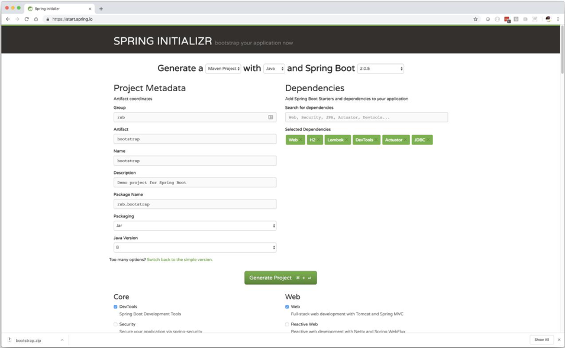

= Bootstrap

为了更好的在大型的生态环境中理解响应式编程，我们需要了解 Spring。什么是 Spring？什么是依赖注入？我们为什么使用基于 Spring Framework 的 Spring Boot 而不是其他框架。本章是一些
基础入门知识。我们不在本章中讨论响应式编程。如果您已经了解了依赖注入、控制反转、Java 配置、Spring 应用程序上下文、面向切面编程（AOP）和 SpringBoot 的自动配置，请务必跳过此章。

至于其他，我们将通过构建一些东西来展示一些关键的概念。和往常一样，我们从 https://start.spring.io[Spring Initializr] 开始我们的旅程。我们的目标是构建一个简单的应用程序，我在 `Group` 字段中
指定了 `rsb`，在 `Artifact` 字段中输入 `bootstrap`，您也可以填写您喜欢的任何内容。在页面右下角显示搜索依赖的组合框中选择以下依赖：`Devtools`，`Web`，`H2`，`JDBC`，`Actuator` 和 `Lombok`。

`Devtools` 允许我们通过运行 IDE 的构建命令来重新启动应用程序，无需重启整个 JVM 进程。这让我们可以更快的迭代并查看编译代码中的更改。它还会启动一个 Livereload 协议的服务器。有一些浏览器插件可以监听此服务器上
的消息并强制刷新浏览器页面，为您提供所见即所得的体验。

[TIP]
====
如果你使用的是 Spring Tool Suite，那么你只需要保存你的代码即可。IntelliJ 没有内置的 `save` 的概念，因此，没有处理此时间的 hook。您需要改为 "build" 代码。转到 `Build > Build the Project` 。
在 Mac 上，您可以使用 `Cmd + F9` 快捷键
====

`Web` 帮助我们引入了基于 Servlet 规范和构建传统 Spring MVC 应用程序所需的一切。有表单验证，JSON 和 XML 编组，websocket，REST 和 HTTP 控制器支持等等。`H2` 是一个嵌入式数据库，每次重启都会丢失其状态。
这对于我们来说是比较理想的，因为我们不需要安装数据库（或重置它）。

`JDBC` 引入了对 SQL 数据库的支持，例如 JdbcTemplate

`Lombok` 是一个编译时注解处理器，它综合了诸如 getter，setter，`toString()`，`equals()` 等方法。我们只需要很少的注解即可。大多数注解都以简明该，对类的描述不言自明。

`Actuator` 在 `/actuator/\*` 下提供 HTTP 端点，可以通过这些端点查看应用程序的状态。

这里还有一些其他选项。您要使用的 JVM 版本（我建议使用与最新 OpenJDK 构建对应的版本），您想要使用的语言？我们稍后探索 Kotlin，现在让我们使用 Java。emmmm，Groovy，似乎也是一个不错的选择。对于这个简单的
应用程序，其他选项都可以使用默认值。

对于我们指定的所有内容，我们并没有指定 Spring 本身，日志库，或需要完成这项工作的其他任何框架。使用 Spring Boot 时，这些依赖项已经隐含在其他依赖中，因此我们无需担心。

现在，是不是欲哭无泪，"响应式怎么样了？"，别担心，我保证，我们终会到达哪里。但我们在本节中介绍的任何内容都不涉及 Reactive，因为我们需要一个基线。好了，现在，假设你对 JDBC（Java Database Connectivity API）和
Servlet 规范（在 Java Web 层面上几乎所有的事情都涉及到 Servlet 规范）有一定的了解。

滚动到底部选择 Generate Project

自动生成并打包进 `.zip` 文件中并下载。您可以在浏览器存储下载文件的文件夹中找到。解压此文件，您将看到以下布局:

[source,txt]
----
.
├── mvnw
├── mvnw.cmd
├── pom.xml
└── src
    ├── main
    │ ├─--─ java
    │ │     └── com
    │ │         └── example
    │ │             └── bootstrap
    │ │                 └── BootstrapApplication.java
    │ └─--─ resources
    │       └── application.properties
    └── test
        └── java
            └── com
                └── example
                    └── bootstrap
                        └── BootstrapApplicationTests.java
  12 directories, 6 files
----

这是一个标准的 Maven 项目，您唯一可能不熟悉的是 Maven 包装器 - 以 `.mvnw` 开头的文件。Maven wrapper 提供了 shell 脚本，可以在不同的操作系统之间，下载运行
该项目所使用的 Apache Maven 发行版。当您想让构建以预期的方式运行时特别有用，尤其是在持续集成环境中。当在 UNIX 环境中（MacOS，或任何 Linux 风格），您会运行
`mvnw` ，在 Windows 上，会运行 `mvnw.cmd`。

您的 Maven `pom.xml` 文件应该如下所示:

[source,xml]
----
<?xml version="1.0" encoding="UTF-8"?>
  <project xmlns="http://maven.apache.org/POM/4.0.0"
           xmlns:xsi="http://www.w3.org/2001/XMLSchema-instance"
           xsi:schemaLocation="http://maven.apache.org/POM/4.0.0
  http://maven.apache.org/xsd/maven-4.0.0.xsd">
        <modelVersion>4.0.0</modelVersion>
        <groupId>rsb</groupId>
        <artifactId>bootstrap</artifactId>
        <version>0.0.1-SNAPSHOT</version>
        <packaging>jar</packaging>
        <name>bootstrap</name>
        <description>Demo project for Spring Boot</description>
        <parent>
            <groupId>org.springframework.boot</groupId>
            <artifactId>spring-boot-starter-parent</artifactId>
            <version>2.1.0.RELEASE</version>
            <relativePath/> <!-- lookup parent from repository -->
        </parent>
        <properties>
            <project.build.sourceEncoding>UTF-8</project.build.sourceEncoding>
            <project.reporting.outputEncoding>UTF-8
            </project.reporting.outputEncoding>
            <java.version>1.8</java.version>
        </properties>
        <dependencies>
            <dependency>
                <groupId>org.springframework.boot</groupId>
                <artifactId>spring-boot-starter-actuator</artifactId>
            </dependency>
            <dependency>
                <groupId>org.springframework.boot</groupId>
                <artifactId>spring-boot-starter-web</artifactId>
            </dependency>
            <dependency>
                <groupId>org.springframework.boot</groupId>
                <artifactId>spring-boot-starter-jdbc</artifactId>
            </dependency>
            <dependency>
                <groupId>org.springframework.boot</groupId>
                <artifactId>spring-boot-devtools</artifactId>
                <scope>runtime</scope>
            </dependency>
            <dependency>
                <groupId>com.h2database</groupId>
                <artifactId>h2</artifactId>
                <scope>runtime</scope>
            </dependency>
            <dependency>
                <groupId>org.projectlombok</groupId>
                <artifactId>lombok</artifactId>
                <optional>true</optional>
            </dependency>
            <dependency>
                <groupId>org.springframework.boot</groupId>
                <artifactId>spring-boot-starter-test</artifactId>
                <scope>test</scope>
            </dependency>
        </dependencies>
        <build>
            <plugins>
              <plugin>
                  <groupId>org.springframework.boot</groupId>
                  <artifactId>spring-boot-maven-plugin</artifactId>
              </plugin>
            </plugins>
        </build>
</project>
----

这个 `pom.xml` 文件很简单，在 Spring Initializr 上选择的复选框都表示为 `pom.xml` 文件的 `dependency`。我们选择了 Web，它对于的依赖是 `org.springframework.boot:spring-boot-starter-web`。
对于这个例子，它解释了我们需要至少三个依赖项，但并不能解释所有的依赖项。同时，测试也很重要，在添加到 Maven 构建的依赖项中，我们可以至少可以看到
`org.springframework.boot:spring-boot-starter-test`。通常，Spring Initializr 会根据您添加的库在合适的时候添加其他测试库。如果没有选择其他库，Spring Initializr
会自动生产具有测试依赖的新项目。

我们还可以看到有一个空的属性文件 `src/main/resources/application.properties`， 稍后，我们会对此文件进行配置。Spring 可以读取 `.properties` 文件和 `.yaml` 文件。

这是一个标准的 Spring Boot 应用程序，入口类 `BootstrapApplication.java` 具有  `public static void main(String[] args)` 方法。这是一个带有 main 方法
和注解的一个空类。很好，虽然我很想留在这里，大谈 Spring Boot。但如果没有一些背景知识，这也不会成为一个入门课程。因此，删除 `BootstrapApplication.java`，我们
会到达那里，但前提是需要一些基础知识。

== A Bigol'Bago'Beans

Spring Framework 是第一个冠以 Spring 绰号的项目，其核心是一个依赖注入的框架，依赖注入很简单，但影响深远。其思想也很简单：应用程序变化很大，从广义上讲，
解耦有助于降低更改应用程序和系统架构带来的成本，因此，我们需要一种不知道依赖（协作对象）在何处的方式来编写代码。

== CustomerService

假设我们已经编写了一个 CustomerService 接口，现在，我们需要为其提供一种实现：

// include::code:CustomerService[]

[source,java]
----
public interface CustomerService {

    Collection<Customer> save(String... names);

    Customer findById(Long id);

    Collection<Customer> findAll();
}
----

CustomerService 本身并不像它最终会如何连接在一起那么有趣，编写实现 - 需要使用那些依赖对象，这会影响到以后更改实现的难易程度。当您向系统中添加更多类型时，会增加此成本。
在软件项目的长期维护中，预先编写可维护的代码总是好的

在 Spring 的核心 JDBC 支持中，`JdbcTemplate` 是许多人使用的 Spring 的实用工具类。它在 Spring 生命周期的大部分时间都存在，并支持常见的 JDBC 操作，可以避免我们
使用 JDBC 时涉及到的大量样板代码（创建和销毁会话或事务，结果集映射到对象，参数绑定等等）。

为了让对象关系映射（ORM）的讨论变得简单 - Spring 本身以某种方式很好的支持范例 - 我们将在我们的实现中坚持使用 `JdbcTemplate`，让我们来看以下 `BaseCustomerService`，
它需要一个 `DataSource` 实例，并实例化一个新的 `JdbcTemplate` 实例

[source,java]
----
public class BaseCustomerService implements CustomerService { // <1>

    private final RowMapper<Customer> rowMapper = (rs,i) -> new Customer(rs.getLong("id"),rs.getString("NAME"));

    private final JdbcTemplate jdbcTemplate; // <2>

    public BaseCustomerService(DataSource dataSource) { // <3>
        this.jdbcTemplate = new JdbcTemplate(dataSource);
    }

    @Override
    public Collection<Customer> save(String... names) {
        List<Customer> customerList = new ArrayList<>();

        for(String name : names) {
            GeneratedKeyHolder keyHolder = new GeneratedKeyHolder();
            this.jdbcTemplate.update((connection) -> {
                PreparedStatement ps = connection.prepareStatement("insert into CUSTOMERS(name) values (?)"
                        , Statement.RETURN_GENERATED_KEYS);
                ps.setString(1,name);
                return ps;
            },keyHolder);
            Long keyHolderKey = Objects.requireNonNull(keyHolder.getKey().longValue());
            Customer customer = this.findById(keyHolderKey);
            Assert.notNull(name,"the name given must not be null!");
            customerList.add(customer);
        }
        return customerList;
    }

    @Override
    public Customer findById(Long id) {
        String sql = "select * from CUSTOMERS where id = ?";
        return this.jdbcTemplate.queryForObject(sql,rowMapper,id);
    }

    @Override
    public Collection<Customer> findAll() {
        return this.jdbcTemplate.query("select * from CUSTOMERS",rowMapper);
    }
}
----
<1> 这是一个 public 类，因为在本章中我们会在不同的包中有不同的实现。通常，你应该不会在不同的包中有多个实现，你应该尽可能的为实现分配不可见的修饰符。我的大部分代码的包都是私有的（根本没有修饰符）
<2> `JdbcTemplate` 引用我们需要的数据源
<3> 它需要一个数据源

== 不灵活的实现

实现的第一步是需要确定其与 RDBMS 对话的 `java.sql.DataSource` 实例。它需要该对象能够与数据库进行交互。这个数据库肯定会根据环境而改变位置。因此，在 Java 中对开发数据库
的凭据进行硬编码是错误的，进具体的说，将 `DataSource` 对象的创建隐藏在 `CustomerService` 实现中是错误的。出于多种原因，最重要的是安全性，这是一种糟糕的想法。
因为它将本地计算机上运行的数据库和代码耦合起来，无法切换数据库驱动程序的 URL。

[TIP]
====
如果你的开发，测试和集成测试数据库都是同一个数据库，这将是非常糟糕的
====

一个 `CustomerService` 的本地实现 - 但不建议这么做

[source,java]
----
public class DevelopmentOnlyCustomerService extends BaseCustomerService {

    public DevelopmentOnlyCustomerService() {
        super(buildDataSource());
    }

    private static DataSource buildDataSource() { // <1>
        EmbeddedDatabase dataSource = new EmbeddedDatabaseBuilder()
                .setType(EmbeddedDatabaseType.H2)
                .build();
        return DataSourceUtils.initializeDdl(dataSource);
    }
}
----
====
<1> 在 `CustomerService` 实现中硬编码创建数据源，这里使用的是基于内存数据库的嵌入式 H2
====

最大的遗憾是，这个实现除了硬编码将 `DataSource` 传递给父构造函数之外，并没有做其他任何事。`BaseCustomerService` 是参数化的，它保留了可选性，这个子类几乎是
不遗余力的通过对 `Datasource` 进行硬编码来删除可选性，真的是浪费。`DataSource` 确实是需要在某个地方创建，但我们希望不应该在它的实现中创建。`DataSource` 表示
与网络服务的实时连接，当我们的应用程序从一个环境（开发，QA，staging 等）迁移到另一个环境时，其位置可能会发生变化。在这个糟糕的例子中，我们使用了内存和嵌入式数据库，
但这并不是常见的情况，在大多数情况下，我们通常会有一个需要指定 URIS，位置，凭据的数据源

`DataSource` 在使用前需要进行一些初始化设置，此示例在 `CustomerService` 实现时已经进行了创建和初始化逻辑。如果你对初始化逻辑比较好奇，我们将在后续示例中使用此
方法 `DataSourceUtils#initializeDdl(DataSource)`

[source,java]
----
public class DataSourceUtils {

    public static DataSource initializeDdl(DataSource dataSource) { // <1>
        ResourceDatabasePopulator populator = new ResourceDatabasePopulator(
                new ClassPathResource("/schema.sql")); // <2>
        DatabasePopulatorUtils.execute(populator,dataSource);
        return dataSource;
    }
}
----
====
<1> `ResourceDatabasePopulator` 来自 Spring Framework。它支持执行一个或多个 SQL 文件执行 SQL 语句。例如，如果在尝试运行 `CREATE TABLE` 操作时，如果数据库已经存在。或者继续，或者使其初始化失败
<2> Spring 提供了一个抽象概念 `Resource`，它代表了我们可能想要执行输出和输入的某种资源。`ClassPathResource` 代表应用程序类路径资源
====

下面演示如何使用这个实现

[source,java]
----
public class Application {

    public static void main(String[] args) {
        DevelopmentOnlyCustomerService customerService = new DevelopmentOnlyCustomerService();
        Demo.workWithCustomerService(Application.class,customerService);
    }
}
----

我们使用 Demo#workWithCustomerService(CustomerService) 来测试最终的实现，后续的例子中会用到这个方法，我们来看看他的定义：

[source,java]
----
public class Demo {

    private static final Logger log = LoggerFactory.getLogger(Demo.class);

    public static void workWithCustomerService(Class<?> label, CustomerService customerService){
        // <1>
        log.info("================================");
        log.info(label.getName());
        log.info("================================");

        // <2>
        Stream.of("A","B","C").map(customerService::save)
                .forEach(customer -> {
                    log.info("saved " + customer.toString());
                });

        // <3>
        customerService.findAll()
                .forEach(customer -> {
                    Long id = customer.getId();
                    // <4>
                    Customer byId = customerService.findById(id);
                    log.info("found " + byId.toString());
                    Assert.notNull(byId,"the resulting customer should not be null!");
                    Assert.isTrue(byId.equals(customer),"we should be able to query for this result");
                });
    }
}
----
====
<1> 解释我们要做什么
<2> 使用我们的实现向数据库写入一些数据
<3> 查找数据库中的所有记录
<4> 确认我们可以通过 id 找到每条记录
====

这段代码看起来像是一个测试，也确是如此。每个示例都有一个 JUnit 单元测试，基本上使用相同的代码路径。我们将专注于如何在 `public static void main` 应用程序的上下文
中建立每个示例，并进行测试。可以这么说，测试和演示我们都使用相同的代码。

`DataSource` 实例的代价很高并且通常需要在服务之间共享，所以，在使用他们的地方创建没有任务意义。取而代之的是，让我们集中在一处创建它们，它不需要关心我们如何编写自己的代码。

== 参数化实现

为了改进我们的示例并恢复可选性，最简单的方式就是通过构造函数对 `DataSource` 进行参数化

[source,java]
----
public class DataSourceCustomerService extends BaseCustomerService {
    // <1>
    public DataSourceCustomerService(DataSource dataSource) {
        super(dataSource);
    }
}
----
====
<1> 具有调用父类构造函数的构造函数
====

下面是重构的 `main` 方法

[source,java]
----
public class Application {

    public static void main(String[] args) {
        // <1>
        EmbeddedDatabase dataSource = new EmbeddedDatabaseBuilder()
                .setType(EmbeddedDatabaseType.H2)
                .build();
        // <2>
        DataSource initializeDataSource = DataSourceUtils.initializeDdl(dataSource);
        CustomerService customerService = new DataSourceCustomerService(initializeDataSource);
        Demo.workWithCustomerService(Application.class,customerService);
    }
}
----
====
<1> 我们的 `CustomerService` 仅依赖指向数据源的指针，我们可以随时更改此引用
<2> `CustomerService` 只关系它有一个完整的数据源引用，不需要连接初始化逻辑
====

这样好多了，此实现支持通过基类型进行参数化构造，这种情况下，我们的代码并不知道 `DataSource` 引用的来源。他可以是测试中的模拟实例，也可以是生产环境中的生产级连接池数据源。

你会注意到一点，代码在事务管理中有点愚蠢，因为它根本不处理事务。我们的实现可以说是比较乐观的，所有的这些都是以我们假设没有任何问题的方式编写的。公平的说，`findById` 和 `findAll` 方法
是查询。因此，查询要么返回我们要求的结果，要么不返回

== Template

对于那些读取数据的方法，您可能会忽略其原子性和事务，因为只有一个查询，当循环遍历所有输入参数使用 `save(String... names)` 插入到数据库时，事情就有点复杂了。当然，我们可能考虑到使用
SQL 批处理，但也引发了我们的一个思考：如果在处理所有的 `String... names` 参数过程中出现问题怎么办？这时，我们已经将一条或者多条数据插入到数据库中，这是可以接受的吗？
在我们的例子中，可以，有总比没有没有好。但是，有时候，您可能试图将几条相关信息写入数据库，如果这些相关信息没有同时写入数据库，它们将不一致，那么它们的完整性就得不到维护

在一些包括 SQL 数据存储的中间件中支持事务的概念，您可以将多个相关的事务封装到一个工作单元中，然后同时提交所有这些相关的事务。要么写入事务中的内容，要么回滚所有内容，
结果就像您根本没有写任何东西一样。以这种方式对系统进行推理要容易的多，您不必猜测写入的那部分成功了，那部分没有成功。

当我们在基于 SQL 数据存储和 `JdbcTemplate` 的上下文中查看事务的概念时，，这不是数据库独有的。`MongoDB` 也支持事务。许多您最喜欢的消息队列（如 `RabbitMQ` 或支持 `JMS` 规范的消息队列）也是如此。
`Neo4J` 也是如此。在 Spring 中，处理事务的基本流程用 `PlatformTransactionManager` 表示，有不同的实现以支持不同的技术。您可以使用 `PlatformTransactionManager` 显式的开始工作，
提交或者回滚。这很简单，但是必须编写 `try/catch` 语句来处理工作单元，在没有异常时提交，有异常时回滚。这时很乏味的，即使你使用了 `PlatformTransactionManager`。

因此，Spring 提供了 `TransactionTemplate`，将其简化为一行。您只需要提供一个在打开的事务上下文中执行的回调。如果您抛出任何异常，则会导致混滚。否则，事务将被提交。
让我们重新整理我们的例子，这次使用事务。

[source,java]
----
public class TransactionTemplateCustomerService extends BaseCustomerService {

    private final TransactionTemplate transactionTemplate; // <1>

    public TransactionTemplateCustomerService(DataSource dataSource,
                                              TransactionTemplate transactionTemplate) {
        super(dataSource);
        this.transactionTemplate = transactionTemplate;
    }

    @Override
    public Collection<Customer> save(String... names) {
        return this.transactionTemplate.execute(s -> super.save(names));
    }

    @Override
    public Customer findById(Long id) {
        return this.transactionTemplate.execute(s -> super.findById(id));
    }

    @Override
    public Collection<Customer> findAll() {
        return this.transactionTemplate.execute(s -> super.findAll());
    }
}
----
====
除了 `DataSource` 外，此类还需要依赖 `TransactionTemplate`
====

好多了，现在我们不需要手动去捕获异常了，也能返回一个正常的结果，并且也不需要我们清理数据库。这一切并不难，现在，让我们看一下在应用程序中如何将一些必要的对象连接在一起

[source,java]
----
public class Application {

    public static void main(String[] args) {
        EmbeddedDatabase dataSource = new EmbeddedDatabaseBuilder()
                .setType(EmbeddedDatabaseType.H2)
                .build();

        DataSource initializeDataSource = DataSourceUtils.initializeDdl(dataSource); // <1>
        PlatformTransactionManager dsTxManager = new DataSourceTransactionManager(initializeDataSource); // <2>
        TransactionTemplate transactionTemplate = new TransactionTemplate(dsTxManager); // <3>
        // <4>
        CustomerService customerService = new TransactionTemplateCustomerService(initializeDataSource,transactionTemplate);
        Demo.workWithCustomerService(Application.class,customerService);
    }
}
----
====
<1> 和之前一样，初始化数据源
<2> 创建 PlatformTransactionManager 实例 DataSourceTransactionManager
<3> 使用 TransactionTemplate 包装 PlatformTransactionManager
<4> 其余同上
====

好多了，现在我们不需要手动去捕获异常了，也能返回一个正常的结果，并且也不需要我们清理数据库。`TransactionTemplate` 只是许多 `\*Template` 对象中的一个，就像我们一直在使用的 `JdbcTemplate` 一样，它的目的是
封装事务管理等样板代码。模版方法是一种处理和隐藏其他样板代码，让用户使用尽可能少的代码的一种方法。在这种情况下，我们对数据库所做的事情 - 查询，提取和转换结果等是唯一的，因此我们只需要提供逻辑即可。但与使用
`PlatformTransactionManager` 实现相关的所有其他事情都不是。

你会发现 Spring 提供了许多 `\*Template` 对象。`JmsTemplate` 使使用 JMS 更容易，`AmqpTemplate` 使使用 AMQP 更容易，`MongoTemplate` 和 `ReactiveMongoTemplate` 对象分别以同步，阻塞和异步，非阻塞的方式使使用
MongoDB 更容易，`JdbcTemplate` 使使用 JDBC 更容易，`RedisTemplate` 使使用 Redis 更容易，RestTemplate 使创建 HTTP 客户端请求更容易。还有其他十几个你会在日常工作中经常遇到，还有十几个不起眼但也很有用，如果你需要的
话。我最喜欢的，晦涩的一个是 `org.springframework.jca.cci.core.CciTemplate`，它使通过通用连接器接口（CCI）和使用 Java 连接器结构（JCA）连接器的客户端更容易结合。

[NOTE]
====
您需要它吗？希望您永远不会，这是一个 API，您需要将企业集成系统集成到您的 J2EE/JavaEE 应用程序服务器。本书不会涉及到这些
====

== 应用程序上下文

最后一个例子比之前的例子都要复杂，我们需要创建和配置四个不同的对象才能达到我们的目的。我这里 “做了吗？” 的意思是在方法调用中将 `CustomerService` 作为参数传递到我们的完整配置，我们的例子距离成为业务提供价值
还有很长的路要走。为此，我们需要将实际客户端连接功能，所以我们需要进行部署，并且有可能创建更多这样的服务。另外，也许将我们的内存嵌入式数据库替换为真实的数据库，使其重启后数据仍然存在。现在，我们需要配置这些
不同的对象并将其组件化，所有的一切我们在我们的 `main(String[] args)` 方法中进行，我们必须将代码复制并粘贴到我们的测试中，以确认一切按预期工作。

这不需要扩展，让我们来看一个使用 Spring 编写对象的示例，它支持我们迄今为止努力获得的灵活性，同时简化了生产和测试代码。不需要重写 `CustomerService` - 实际上，一切都与以前一样，只是编写代码的方式发生变化。

Spring 其实就是一堆 Bean，它负责管理 bean 的生命周期，但我们需要告诉它要管理那些对象。一个方式是通过定义对象（称为 "beans"）,在这个例子中，我们将在我们的应用程序类中定义 "bean".

[source,java]
----
// <1>
@Configuration
@Import(DataSourceConfiguration.class) // <2>
public class Application {

    // <3>
    @Bean
    PlatformTransactionManager transactionManager(DataSource dataSource) {
        return new DataSourceTransactionManager(dataSource);
    }

    @Bean
    TransactionTemplate transactionTemplate(PlatformTransactionManager tm) {
        return new TransactionTemplate(tm);
    }

    public static void main(String[] args) {
        // <4>
        ApplicationContext ac = SpringUtils.run(Application.class,"prod");

        // <5>
        CustomerService cs = ac.getBean(CustomerService.class);
        Demo.workWithCustomerService(Application.class,cs);
    }
}
----
====
<1> Application 是一个 `@Configuration` 类，其方法使用 `@Bean` 注解，返回主要的对象，并应用与应用程序上下文中的其他对象。
<2> `DataSource` 的定义会根据我们我们的开发或生产环境改变而改变。我们将这些定义存储在另一个配置中，我们在这里导入类
<3> 在 `@Configuration` 类中每一个带有 @Bean 注解的方法都是 bean 的提供者
<4> 我们在 `SpringUtils.run` 中隐藏了创建 Spring `ApplicationContext` 的复杂性，`ApplicationContext` 有六个有趣的实现，通常，我们不需要关心使用那个以及何时使用，因为 Spring Boot 创建该对象是透明的（我们稍后将使用）。
为了获取 Spring `ApplicationContext` 的实例，我们需要提供配置类和配置文件、标签，prod。
<5> `ApplicationContext` 是 Spring 应用程序的核心。它是存储我们所有配置对象的东西。我们可以通过 beans 的类型（如此处所示）或其 bean 的名称来获取 bean 的引用。
====

那些 @Bean 方法很重要，它展示了我们为 Spring 定义对象及其关系的方式。Spring 启动，调用方法并存储对象，然后将这些对象作为引用以供其他需要它的对象使用。当 Spring 提供对依赖的引用时，我们说它已经 “注入” 了依赖。
如果应用程序中其他任何地方需要该方法返回的类型（或多个类型，如果结果表示为接口）的对象，它们将调用第一次获得单个实例的引用的方法。

如果一个 bean 需要引用另外一个来完成它的工作，它会将这种依赖表示为 bean 方法中的一个参数。Spring 将查找适当定义的任何 bean，并在调用我们的方法时将它们作为参数提供。

这一切的好处是，如果我们每个人都想重新创建整个应用程序，我们只需要提供一个 `ApplicationContext` 实例，我们所有对象就会聚集在一起。在第一个示例中，我们使用的是普通的 Spring 框架。这没有什么特别之处，让我们
看看我们是如何创建 `ApplicationContext` 实例的，但请记住，我们以后不需要这样的样板代码

[source,java]
----
public class SpringUtils {

    public static ConfigurableApplicationContext run(Class<?> sources, String profile) {
        // <1>
        AnnotationConfigApplicationContext applicationContext = new AnnotationConfigApplicationContext();

        // <2>
        if(StringUtils.hasText(profile)) {
            applicationContext.getEnvironment().setActiveProfiles(profile);
        }

        // <3>
        applicationContext.register(sources);
        applicationContext.refresh();

        // <4>
        applicationContext.start();
        return applicationContext;
    }
}
----
====
<1> 我们正在使用一个 `ApplicationContext` 实例，它可以处理以注解为中心的配置，也称为 “Java 配置”
<2> 它告诉 Spring 根据各种条件创建或者不创建对象，这个条件是 "这个 bean 是否有与之关联的 profile 文件？"，profile 是附加到对象定义的 label 或 tag。我们现在还没有看到一个，
但后面会看到的。通过配置 active profile 文件，创建所有没有 profile 和我们激活的 profile 特定的配置的所有对象。
<3> 在这种情况下，我们正在注册一个配置类。在其他情况下，`sources` 可能是其他类型的输入组件
<4> 最后，我们启动 Spring，他会触发所有对象的创建并加载
====

接下来让我们看看如何在 `DataSourceConfiguration` 中处理 `DataSource` 定义。我已将这些定义提取到一个单独的类中，以便我们以后可以重用它们的定义。
我想将构建 `DataSource` 的复杂性集中在一块，我们将利用配置文件来创建两个数据源的定义，一个生成内存中的 H2 数据源，一个是根据提供的 driver class name，username，password 和 JDBC url
生成数据源。这些参数是可变的，可能随着开发人员的机器而改变，也可能随环境改变。

Spring 有一个 `Environment` 对象，您可以在任何地方进行依赖注入，它充当配置的字典 - 键和值，值可能来源于任何地方 - 属性文件、YAML 文件、环境变量、数据库等。
您可以通过向 `Environment` 提供 `PropertySource` 类型的对象来向环境配置新的来源。Spring 有一个 `@PropertySource` 注解，他从文件中获取任何配置值并将
它们添加到 `Environment` 中，在 `Environment` 中，您可以使用 `@Value` 注解将这些值注入 bean 方法中的配置参数。

[source,java]
----
@Configuration
public class DataSourceConfiguration {

    // <1>
    @Configuration
    @Profile("prod") // <2>
    @PropertySource("application-prod.properties") // <3>
    public static class ProductionConfiguration{
        @Bean
        DataSource productionDataSource(@Value("${spring.datasource.url}") String url, // <4>
                                        @Value("${spring.datasource.username}") String username,
                                        @Value("${spring.datasource.password}") String password,
                                        @Value("${spring.datasource.driver-class-name}")Class<Driver> driverClass) { // <5>
            DriverManagerDataSource dataSource = new DriverManagerDataSource(url, username, password);
            dataSource.setDriverClassName(driverClass.getName());
            return dataSource;
        }
    }

    @Configuration
    @Profile("default") // <6>
    @PropertySource("application-default.properties")
    public static class DevelopmentConfiguration {

        @Bean
        DataSource developmentDataSource() {
            return new EmbeddedDatabaseBuilder().setType(EmbeddedDatabaseType.H2).build();
        }
    }

    @Bean
    DataSourcePostProcessor dataSourcePostProcessor() {
        return new DataSourcePostProcessor();
    }

    // <7>
    private static class DataSourcePostProcessor implements BeanPostProcessor {

        @Override
        public Object postProcessAfterInitialization(Object bean, String beanName) throws BeansException {

            if(bean instanceof DataSource) {
                DataSourceUtils.initializeDdl(DataSource.class.cast(bean));
            }
            return bean;
        }
    }

}
----
====
<1> `@Configuration` 类可以充当其他配置类的容器。当我们导入 `DataSourceConfiguration` 类时，Spring 还会解析任何嵌套的配置类
<2> 此配置类仅在当 "prod" 配置处于激活状态才激活
<3> 告诉 Spring 我们需要来自 `application-default.properties` 属性文件中的配置值
<4> 使用 `@Value` 注解根据 key 从配置文件中注入值
<5> Spring 可以将属性文件中的字符串转换为更复杂的类型，如 `Class<T>`，因为它委托给 Spring 中的 `ConversionService` ，您也可以自定义此对象
<6> `default` profile 是一个特殊的 profile，它仅在没有任何其他 profile 时才处于激活状态。因此，如果您专门激活 `prod` profile，则 `default` 不会激活。如果您
不激活任何 profile，则将启动 `default` profile。因此，默认情况下将提供此配置中的所有对象。在这里，我们配置了一个基于内存的嵌入式 H2 数据库。
<7> 在前面的示例中，我们使用 `DataSourceUtils#initializeDdl` 来确保 `DataSource` 在使用之前运行其使用的 DDL。现在，我们有两个地方可以定义数据源。
我们可以简单的在这两个位置复制该逻辑，但这违反了 DRY（不能重复自己）原则。相反，我们将配置一个 `BeanPostProcessor` 类型的对象。`BeanPostProcessor` 是一个回调接口，它提供了两种（默认）方法。
在这里，我们的类重写了 `postProcessAfterInitialization` 方法，我们判断对象的类型，以确认它是某种数据源，然后我们进行初始化。这样，无论 `DataSource` 如何创建或者在哪里创建。`BeanPostProcessor` 都会确保它被正确初始化。
Spring 有其他生命周期事件和关联的回调接口，您可能会经常看到它们，`BeanPostProcessor` 是比较常见的一种
====

在 `Application` 类中，我们我们显式的传入 `prod` profile，不过，这不是配置 profile 的唯一方法。这是一种限制性的方法，将 profile 硬编码进应用程序逻辑中。在正常的工作流程中，您可以将应用程序二进制文件从
一个环境提升到另一个环境而不需要重新编译，这样您就不会冒着风险将变量引入构建。因此，您需要某种方式来更改 profile 而无需重新编译。当启动 java 应用程序时，Spring 支持命令行参数 `-spring.profiles.active=prod`。您
还可以在你主类的 `main` 方法中指定此属性。在 `SpringApplication.run` 调用之前指定 `System.setProperty("spring.profiles.active","prod")`，`prod` profile 则会使用自己的属性文件 `application-prod.properties` 中的属性。

[source,properties]
----
spring.datasource.url=jdbc:h2:mem:rsb;DB_CLOSE_DELAY=-1;DB_CLOSE_ON_EXIT=false
spring.datasource.username=sa
spring.datasource.password=
spring.datasource.driver-class-name=org.h2.Driver
----

当然，您也可以更改这些属性值。如果您使用的是 PostgreSQL 或 Mysql 或 Oracle，或者其他任何东西，相应的更新这些值即可。

== 组件扫描

配置类的有点显而易见，我们只需要检查应用程序中的类就可以查看到每个对象的连接。随着我们当应用程序添加新对象，每当新增一个服务，都需要在这个配置类中进行配置。Spring 支持大量不同类型的对象 - 组件是最简单的层次结构，
它还支持 controllers，services，repositories 和其他类型。对于添加到 Spring 应用程序中的每个对象，您需要在配置类中有一个相应的配置，这是否本身也违反了 DRY。

如果我们在应用程序启动时执行组件扫描，那么 Spring 可以隐式地连接每个对象。如果我们将 `@ComponentScan` 注解添加到我们的应用程序，Spring 将自动发现当前包或子包下的任何对象，对这些对象进行标记 -或 "stereotype" 注解。
这也是对 Java 配置的补充。在这种情况下，Spring 的组件扫描将发现我们开发人员定义的所有的 Spring 对象。例如，我们的 service 或者 HTTP Controller，而我们将 `DataSource` 和 `TransactionTemplate` 之类的使用
Java 配置。换句话说，如果您有权访问源代码并且可以使用 Spring 注解，那么您可能会考虑让 Spring 通过组件扫描来发现对象。

当 Spring 找到一个带有注解的对象时，它将检查构造函数，如果找不到构造函数，它将使用默认的构造函数来实例化应用程序实例。如果它找到一个没有参数的构造函数，则会调用这个方法实例化。如果它找到一个有参构造函数，其值可以
被 Spring 应用程序中的其他对象满足（它可能与我们这里 bean 定义的方式相同），那么 Sprig 将提供这些协作对象。如果它找到多个不明确的构造函数，您可以通过使用 `@Autowired` 注解来告诉 Spring 使用那个构造函数，来消除与其他
构造函数的歧义。

让我们根据组件扫描稍微修改以下我们的示例

[source,java]
----
@Configuration
@ComponentScan // <1>
@Import(DataSourceConfiguration.class)
public class Application {

    @Bean
    PlatformTransactionManager transactionManager(DataSource dataSource) {
        return new DataSourceTransactionManager(dataSource);
    }

    @Bean
    TransactionTemplate transactionTemplate(PlatformTransactionManager tm) {
        return new TransactionTemplate(tm);
    }

    public static void main(String[] args) {
        ApplicationContext ac = SpringUtils.run(Application.class,"prod");

        CustomerService cs = ac.getBean(CustomerService.class);
        Demo.workWithCustomerService(Application.class,cs);
    }
}
----
====
<1> 这里唯一需要注意的是，我们已经使用 `@ComponentScan` 注解启用了组件扫描，并且我们没有提供 `CustomerService` 类型的 `@Bean`，因为 Spring 会在组件扫描时自动检测到该类型。
====

如果，我们给他加注解，它会在组件扫描时发现 `CustomerService` 类型。让我们创建一个新类型，它只有一个构造函数和一个 `@Service` 注解

[source,java]
----
@Service // <1>
public class DiscoveredService extends TransactionTemplateCustomerService {

    // <2>
    public DiscoveredService(DataSource dataSource, TransactionTemplate transactionTemplate) {
        super(dataSource, transactionTemplate);
    }
}
----
====
<1> `@Service` 是一个模式注解（stereotyle annotation），这个类和 `Application.java` 在同一个包中，我们只需要对其进行注解就可以发现 它。大多数代码库的类层次结构都不高，因此模式注解将在具有业务逻辑的实现类中编写，
<2> `Application` 类定义了这些类型的实例，因此我们知道 Spring 可以满足这些依赖
====

== 使用 `@Enable*` 注解声明容器服务

我们引入 Spring 并添加了一个类来支持我们的配置，我们将对象的编写从 `main(String[])` 方法中释放出来并放入到这个配置类中，使我们的代码有更多的活动空间。不难看出，Spring 可以使事情变得简单 - 尤其是在使用
组件扫描 -因为我们像应用程序中添加了更多的对象。现在，我们可以做些什么来简化代码，我们可以看到，我们的服务现在使用 `TransactionTemplate` 来管理事务，我们使用 `TransactionTemplate` 为我们的核心功能
划分事务边界，对于我们添加的每个方法，我们都需要使用相同的方式来包装事务划分逻辑。这种横切关注点 - 事务划分 - 是我们经常遇到的事情，尽管这是一个简单的要求，但也不应该需要使用大量的代码来包装它。让我们来
看看如何使用声明式事务来简化代码

[source,java]
----
@Configuration
@EnableTransactionManagement // <1>
@ComponentScan
@Import(DataSourceConfiguration.class)
public class Application {

    @Bean
    PlatformTransactionManager transactionManager(DataSource dataSource) {
        return new DataSourceTransactionManager(dataSource);
    }

    @Bean
    TransactionTemplate transactionTemplate(PlatformTransactionManager tm) {
        return new TransactionTemplate(tm);
    }

    public static void main(String[] args) {
        ApplicationContext ac = SpringUtils.run(Application.class,"prod");

        CustomerService cs = ac.getBean(CustomerService.class);
        Demo.workWithCustomerService(Application.class,cs);
    }
}
----
====
<1> 现在唯一的区别就是我们启用了声明式事务管理
====

除了一个额外的注解外，其他部分和之前都是一样的。现在，我们可以重新实现 `CustomerService`，好吧，我们不必真正重新实现它，真的。简单地使用 `@Transaction` 注解即可，
实现类中的所有 `public` 方法都会自动划分事务

[source,java]
----
@Transactional // <1>
public class TransactionCustomerService extends BaseCustomerService {
    public TransactionCustomerService(DataSource dataSource) {
        super(dataSource);
    }

    @Override
    public Collection<Customer> save(String... names) {
        return super.save(names);
    }

    @Override
    public Customer findById(Long id) {
        return super.findById(id);
    }

    @Override
    public Collection<Customer> findAll() {
        return super.findAll();
    }
}
----
====
这里唯一的区别就是使用 `@Transactional` 注解 Spring bean
====

就是这样，`@Transactional` 注解有一些属性，这些属性为我们使用 `TransactionTemplate` 管理事务时提供了一些灵活性。如前所述，我们获得了所有的 `public`
方法的默认事务划分。我们可以通过使用 `@Transactional` 注解注解每个方法并覆盖类级别的配置，来指定每个方法的事务。

== 一个 "Bootiful" 应用程序

到目前为止，我们已经构建了一个可以与数据库交互，管理声明式事务的应用程序，并且我们已经尽可能的简化了代码，Spring 可以为您处理大量的样板代码，使代码看起来更简洁。不过，到目前为止，我们只专注于创建与数据库交互的服务，
离达到生产级还很远！在我们有一个客户端可以连接到 REST API 之前，还有很多事情需要解决，我们还有很多事要做。我们已经走了很长的一段路，然而。。。我们仍无处可去。我们需要搭建一个 Web 服务，配置一个 Web 框架，设置
安全性等等。

Spring 已经包含了所有，确实，我们可以将 Spring MVC 用于基于 Servlet 的 Web 应用程序。我们可以使用 Spring Data 及其支持跨 SQL 和 NOSQL 数据存储的众多数据访问模块。我们可以使用 Spring Security 在
我们的应用程序中集成身份验证和授权。我们可以使用 Spring Integration 来构建与 Apache Kafka，RabbitMQ，FTP，IMAP，JMS 等以消息为中心的数据流。我们还可以使用 Spring Batch 来支持对大型顺序访问作业
的批处理。还有微服务？是的，这也有许多需要注意的地方。

我们还需要关系可观测性 - 需要一些东西来阐明应用程序的健康状态，以便我们可以在生产环境中放心的使用，并且对其进行有效监控。监控很重要，它可以使我们衡量，进行取舍。让我们看看我们是否可以提高一个档次。

=== 配置 Web 框架的约定的兴起

我们需要提高生产力，还有很多的事情要做，但如果我们能花费更少的时间去做的话就好了，这并不是一个新问题，而且 Java 社区和其他社区已经付出了很多的努力来支持更高效的开发应用程序。

Ruby on Rails，2004 年首次亮相，并在 2000 年代初期变得炙手可热的 Web 框架。这是第一个支持所谓的 "约定优于配置（convention over configuration）" 的项目，其对一些常规的场景进行了优化，使其变得简单，易于开发。
在那些日子里，有许多关于 Web 应用程序 “保姆数据库” 的讨论。你还需要什么？在前段基于 HTML 和后端与 SQL 数据库交互符合当时 80% 的应用程序。Ruby on Rails 针对此特定结果进行了优化，Rails 团队有一个著名的
 5 分钟演示，在实际的 5 分钟内，它们初始化了一个新的应用程序并集成了数据访问和操作该数据库的一个界面。这是构建与 SQL 数据库交互的用户界面的一种非常快速的方法。Ruby on Rails 由代码生产驱动，并受到 Ruby 语言
动态特性的好处。它将数据库状态的表示与用户交互的 HTML 表单和视图结合。它使用大量代码生成来实现目标，用户与命令行 shell 交互，然后生成映射到 SQL 数据库中状态的新实体。它们使用 shell 生成具有视图和实体的 “脚手架”。
该方法比当时 prolific 技术有了很大的改进

Ruby on Rails 的反对者会说，要解除潜在的假设（Assumptions）使非常困难的。由于大多数 Ruby on Rails 应用程序都是自动生成的代码和高度自我化的运行时代码，因此很难在不重写框架的前提下取消框架所做的选择。它为您生成的代码
要么按您希望的方式工作，要么您必须废弃所有内容。普通 Web 开发人员面临的用例发生的改变，如果您想要一个用户界面来依次操作两个不同的数据库实体，那么事情就变得困难起来了。如果您想构建一个基于 HTTP 的 REST API，
那么您就不走运了，如果您想集成 NOSQL，那么就只能靠你自己了。所有的这些东西最终都添加到了 Ruby on Rails 中。当然，它已经进行了改善，但批评仍然挥之不去。现在，到了 2020 年，Ruby on Rails 针对错误进行了
优化。大多数应用程序不在是维护 数据库的 Web 应用程序。它们是基于客户端服务的架构。客户端不仅在不同的逻辑层中运行，而且在不同的物理层中运行。在 Android，IOS 以及功能丰富且强大的 HTML5 浏览器（如 Google Chrome 和 Mozilla Firefox）中运行。

Spring 团队也有一段有趣的历史。Spring 团队参与了两项值得注意的工作，第一个是 Spring Roo，他是一种用于 Java 开发代码的生成方法。Spring Roo 的开发背景是，大约在 2008 年时，Java 应用程序中有大量不是 Java 代码
的组件。XML 部署描述符、基于 JSP 的视图、Hibernate 映射配置的 XML 文件。真的有很多东西，Spring Roo 采用了非常类似 Ruby on Rails 为中心的代码生成方法，但也同样存在致命缺陷。Assumptions 太难解除。它针对
一种类型的应用程序进行了优化。

Grails 更依赖运行时配置，它有代码生成功能，但它的大部分动态特性来自 Groovy 语言，它采用这种语言是为了支持它的某些功能。Spring Roo 和 Grails 都是建立在 Spring 之上。Spring Roo 生成了一大堆基于 Spring 的
代码，如果需要，可以更改这些代码，但这可能是一项艰苦的任务。Grails 相反，它支持元编程和钩子，可以覆盖运行时 `Assumptions` 。Grails 无疑是这两个选项中最成功的。我甚至认为他是继 Ruby on Rails 之后，所有
约定大于配置的 Web 框架中最成功的。

少了什么？Grails 是一种以 Groovy 为中心构建应用程序。如果你不想使用 Groovy 语言（为什么不呢？太棒了！），那么 Grails 可能不是适合您。Grails 在其生命周期的大部分时间里都针对 Web 应用程序保姆级数据库用例
进行了优化。最后，虽然 Java 和常规的 Spring 永远不会希望支持 Groovy 语言中唯一可能的那种元编程，但他们都是动态语言并提供更多的可能性。

=== 云原生应用和服务

现代软件的形态随着架构的变化而变化，我们不再构建 Web 应用程序数据库。相反，客户端和服务对话。有很多服务，小型，单一，可独立部署，可自主更新，可重用，有界上下文。

微服务。微服务是一种可持续交付的新范式的一种软件形态，在这种范式中，组织采用轻松，持续，增量更新。目标是缩短反馈循环，从生产中快速学习迭代。Kenny Bastani 和我在 O'Reilly 的史诗级巨著 Cloud Native java 中
研究了这种范式。这种架构的一种连锁反应就是软件不断的从开发转移到生产，这种变化是不变的。以前只有在临近生产时才担心的问题，现在在刚开始就需要担心。在持续交付流水线中，您可以看到每次 git push 推送
的结果会被推送到生产环境！您将如何处理负载均衡？安全？监控和可观察性？DNS？HTTPS 证书？故障转移？机架服务？虚拟机？容器技术？

为了加入微服务，我们的框架需要针对生产进行优化。并且要尽可能的简化这种无差别的繁琐工作。

=== Spring Boot

2013 年，我们向全世界宣布了 Spring Boot。Spring Boot 是另一种构建 Java 应用程序的方法。Spring Boot 将来自 Spring 和 Java 生态系统的同类组件集成到一个整体中，它为许多场景中的任何一个提供了默认配置。
但是，它同时提供了内置机制来撤销或者覆盖这些默认配置。不需要代码生成。如今，一个 Java 应用程序主要是由 Java 代码和构建工具（`build.gradle` 或 `pom.xml`）组成，并且可以在运行时使用 java 和元编程提供任何动态内容。

让我们重新审视我们的案例，这次是使用 Spring Boot，Spring Boot 就是 Spring。它是您可以编写，但不需要编写的所有的 Spring 配置。Spring Boot 是您与 Spring 团队结对编程的机会。

首先，让我们看一下 `Application` 类

[source,java]
----
@SpringBootApplication // <1>
public class Application {

    public static void main(String[] args) {

        System.setProperty("spring.profiles.active","prod"); // <2>

        SpringApplication.run(Application.class,args); // <3>
    }
}

// <4>
@Profile("dev")
@Component
class DemoListen {
    private final CustomerService customerService;

    public DemoListen(CustomerService customerService) {
        this.customerService = customerService;
    }

    // <5>
    @EventListener(ApplicationReadyEvent.class)
    public void exercise() {

    }
}
----
====
<1> `@SpringBootApplication` 是一个注解，它本身是用其他一些注解进行元注解的，包括 `@Configuration`、`@ComponentScan`、`@EnableAutoConfiguration`。前面两个我们
应该很熟悉，稍后会介绍最后一个
<2> 此应用程序具有在不同 profile 下运行的代码。Spring 可以从环境中获取那个 profile 应该以那种方法激活。包括环境变量或 Java 系统属性。我通常会坚持使用环境变量
<3> `SpringApplication.run(...)` 是标准的 Spring Boot，这是每个应用程序的一部分。它随框架一起提供，并完成我们简单的 `SpringUtils.run` 方法所做的一切（以及更多）。
<4> 在前面的示例中，在生产环境中构建应用程序的方法与测试它的方法不同。所以我们不得不复制代码。在这里，Spring Boot 在测试和生产代码中的行为相同，因此，我们
将对 `Demo.workWithCustomerService(CustomerService)` 的调用保留在一个 bean 中，该 bean 仅在 `dev` profile 处于激活时才能用。
<5> Spring 是一大堆 bean，组件可以通过使用 `ApplicationEvent` 实例相互通信。在这种情况下，我们的 bean 监听 `ApplicationReadyEvent`，它告诉我们应用程序何时准备好开始处理请求。在
启动顺序中尽可能晚的调用此事件。
====

事件监听器机制很不错，因为它意味着我们不在需要混淆 `main(String[] args])` ，从一个应用程序到另一个应用程序完全相同

`@EnableAutoConfiguration` 注解虽然没有看到，但可以说是这段代码的重要组成部分。它激活 Spring Boot 的自动配置。自动配置类由框架在启动时运行，并提供一些对象。具体来说，当 Spring Boot 启动时，他会检查
`CLASSPATH` 上所有的 `.jar` 中的 `META-INT/spring.factories` 文件，Spring Boot 本身提供了一个，当然，您的代码也可以提供一个。`spring.factories` 文件有一些键和其关联的值。

其中，Spring Boot 会检查一行以 `org.springframework.boot.autoconfigure.EnableAutoConfiguration` 开头的键，它的值的每一行是完全限定的类名。这些类是 Java 配置类。它们将对象提供给 Spring 对象图。
然后做一些我们不想做的事，就像配置 Web 服务器一样，或数据源，或者 `PlatformTransactionManager` 和 `TransactionTemplate`。您是否注意到我们没有像示例那也导入 `rsb.bootstrap.DataSourceConfiguration` 类？
我们没有定义任何东西，真的，除了执行我们的 `CustomerService` 实现所需要的 bean

[source,java]
----
@Service // <1>
public class BootifulCustomerService extends BaseCustomerService {
    public BootifulCustomerService(DataSource dataSource) {
        super(dataSource);
    }
}
----
====
此实现只是扩展了现有的带有 `@Transaction` 注解的 `TransactionCustomerService`。我想我们也可以使用 `@Bean` 方法定义那个 bean
====

到目前为止，我们一直在使用属性（来自 `application.properties`）,在应用程序启动时会自动注入。我们一直在使用以 `spring.datasource` 开头的 key，因为这些是 Spring Boot 所期望的。
它甚至会根据激活的 Spring profile 加载正确的配置文件。

这种自动配置已经很有用了，但我们可以做更多。让我们构建一个 REST API。

[source,java]
----
@RestController // <1>
public class BootifulRestController {

    private final CustomerService customerService;

    public BootifulRestController(CustomerService customerService) {
        this.customerService = customerService;
    }

    @GetMapping("/customers") // <2>
    Collection<Customer> get() {
        return this.customerService.findAll();
    }
}
----
====
<1> 这是另一个模式注解，很像 `@Component` 和 `@Service`。它本身是用 `@Component` 进行元注解的。它告诉 Spring 这个类是一个特别的 `@Component`，它
暴露了它期望 Spring MVC（这里使用的 Web 框架）映射到传入的 HTTP 请求处理程序。
<2> Spring MVC 根据处理程序方法上的映射注解知道那些 HTTP 请求与那个处理程序匹配。在这里，此处理程序方法映射 URL `/customers` HTTP GET 请求。
====

运行应用程序并检查日志，它会告诉你 Tomcat 在那个端口启动，然后访问 `http://localhost:<PORT>/customers`，其中 `PORT` 就是您刚刚看到的端口号。在
浏览器中您可以看到生成的 JSON 输出！，您还可以使用 curl 请求该资源。 Spring Boot 不仅为我们配置了一个可用的 Web 框架，它还配置了一个 Web 服务器！这不仅仅是个网络服务器。它还
自动配置了世界领先的 Java Web 服务器 Apache Tomcat，为绝大多数应用程序提供支持。

默认情况下，Spring Boot 在 `8080` 端口上运行，我们可以通过 `application.properties` 或 `application.yml` 文件中通过指定的属性来自定义端口以及有关 Spring Boot 应用程序运行行为的其他内容，如下：

[source,properties]
----
# // <1>
spring.jmx.enabled = true
# // <2>
server.port = 0
# // <3>
management.endpoints.web.exposure.include = *
management.endpoint.health.show-details=always
----
====
<1> 我们是否希望 Spring Boot 通过 JMX 协议导出应用的信息？
<2> 我们希望应用程序在那个端口运行？`server.port = 0` 告诉 Spring Boot 在任何未使用的端口上运行。这很方便
<3> 最后两个属性告诉 Spring Boot 公开所有执行器端点并公开 Actuator Health 端点的详细信息。
====

什么是 Actuator，很高兴你问！我们的应用程序是为生产而设计的，在生产中没有人能听到您的应用程序告警... 除非它从您的监控系统可以检查 HTTP JSON 端点。Spring Boot Actuator 库库自动配置一组标准的 HTTP 端点，
这些端点阐明了应用程序的状态，用来支持可观测性和操作性。想知道应用程序的健康状态如何？访问 `http://localhost:<PORT>/actuator/health` 。像查看指标，访问 `http://localhost:<PORT>/actuator/metrics`。
还有大量其他端点，所有的端点都可以在根端点 `http://localhost:<PORT>/actuator` 访问。

等一下！！！我听到你惊呼，这些 Actuator 端点和为它们提供的服务的 Web 服务器从何而来？回想一下，在这段旅程的开始，我们在 Spring Initializr 中选择了一些依赖，包括 Web 和 Actuator。这导致 `spring-boot-starter-web` 和
`spring-boot-starter-actuator` 被添加到项目的构建文件。这些组件又包含我们的 Spring Boot 自动配置获取和配置的代码。它检测类路径上的类，并且这些类路径上有这些类，然后配置所需的对象。

很漂亮，对吧？