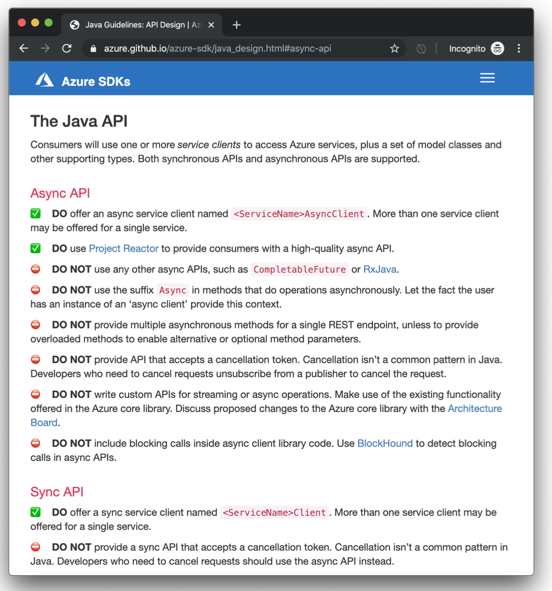

= Reactor

在本章中，我们将了解 Reactive Streams 规范和 Pivotal 的 Reactor 项目中的基础类型，您将在本书其余部分中，几乎将其用于所有其他内容。 可以说，这是最重要的一章。 本书中几乎所有其他内容都只是将这些类型构建到 Spring 中。

如果您已经了解 Spring，那么这就是缺少的部分，delta。 对于那些熟悉 Spring 的人来说，本书的其余部分只是通过集成响应式编程，使其成为可能性。 多么酷啊？ 伙计们，我们到了。 我不想减少本书的其余部分。
他们介绍了明确如何执行的详细信息。 但这是我要开始的地方。 如果你不了解 Spring，好吧，我有一个介绍性的章节你可以阅读它，它不是响应式编程。 它介绍了核心 Spring 概念。 先读那个。 然后这个。 瞧。

你不需要 Spring 来编写基于 Reactor 的应用程序，就像你不需要 Reactor 来编写基于 Spring 的应用程序一样。 这是他们的协同作用，这太令人兴奋了。
但是很多人只用 Reactor 就做出了惊人的事情。 例如，Microsoft Azure SDK 团队在其 Java SDK 客户端的实现中使用它。
在针对 Java 的 Microsoft Azure SDK 指南中，他们甚至鼓励在某些情况下使用它而不是其他选项。

CloudFoundry 团队还仅使用 Reactor 构建了他们的 Java 客户端。

== Reactive Streams 规范

响应式编程为一个相当古老的问题提供了解决方案：我们如何处理更多用户？ 我们如何扩展？ 我们如何更有效地使用我们的线程？ 响应式编程支持协作式多线程。
如果我们愿意改变我们编写代码的方式，以便我们可以让运行时更好地了解我们何时不使用给定线程，那么运行时可以更负责任地安排线程上的工作。 这种效率是一件好事，只要线程是 JVM 上的宝贵资源。

响应式编程要求我们重写代码，以便在使用或不使用给定线程时向运行时发出信号。 我们需要改变描述异步处理的方式。 假设您想对另一个节点进行网络调用。 在传统的阻塞 IO 中，您的代码将位于线程上，阻塞，等待新数据到达。
在此期间，系统中没有其他人可以重用您正在处理的线程。

2015 年，包括 Pivotal、Netflix、Lightbend（né“Typesafe”）和 Eclipse Foundation 在内的一些组织合作提取了一些通用接口来表示异步的、潜在的、可能无限的数据流。

Reactive Streams 规范由四个接口和一个类组成。 让我们看看这四个接口。

.The Reactive Streams Publisher<T> interface.
[source,java]
----
package org.reactivestreams;

public interface Publisher<T> {

  void subscribe(Subscriber<? super T> s);

}
----

第一个接口 `Publisher<T>` 发布 - 广播！ - 到 `Subscriber<T>` 的数据（`T` 类型）。

.The Reactive Streams Subscriber<T> interface.
[source,java]
----
package org.reactivestreams;

public interface Subscriber<T> {

    public void onSubscribe(Subscription s);

    public void onNext(T t);

    public void onError(Throwable t);

    public void onComplete();
}
----

一旦 `Subscriber<T>` 订阅，它就会收到一个 `Subscription`，这可以说是整个 Reactive Streams 规范中最重要的类，我们稍后会讲到它。

`onError` 方法处理流中遇到的任何错误。 Errors - 或 Exception 实例，只是 Reactive Streams 规范中的另一种数据。 他们没有什么特别的。
它们以与常规数据相同的方式进行。 请记住，Reactor 在其工作过程中将执行流从一个线程转移到另一个线程。 这是一个调度程序。
你不能依赖像 `try-catch` 这样的标准控制流机制。 有一个统一的错误处理渠道是一件很简单的事情。

.The Reactive Streams Subscription interface.
[source,java]
----
package org.reactivestreams;

public interface Subscription {

      public void request(long n);

      public void cancel();

}
----

`Subscriber<T>` 在 `onSubscribe` 方法中收到的 `Subscription` 对于每个 `Subscription` 都是唯一的。 新的 `Subscriber<T>` 实例创建新的 `Subscription` 实例。 订阅者将拥有三个不同的订阅。
订阅是生产者和消费者、`Publisher<T>` 和 `Subscriber<T>` 之间的链接。 `Subscriber<T>` 使用 `Subscription` 通过 `request(int)` 数据请求更多数据。 最后一点很关键：订阅者控制数据流和处理速度。
发布者不会产生比订阅者请求的数量更多的数据。 订阅者不能被淹没（如果它被淹没，只能怪自己）。

您是否使用过消息队列，例如 Apache Kafka 或 RabbitMQ？ 消息队列是分布式系统的重要组成部分。它们通过缓冲消息确保分离的组件保持活动状态，允许这些消息的消费者尽可能地使用消息，但不会更快。 这种规范的数据消费就是流量控制。

您曾经使用 TCP/IP 或 UDP 编写过网络协议吗？ 当您设计网络协议时，您需要考虑创建消息帧（通过网络发送的消息的结构），并且您需要考虑当网络交换的一方比另一方移动得更快时会发生什么。然后你进入缓冲等的讨论。 这种规范的数据消费就是流量控制。

订阅允许订阅者在准备好处理数据时请求更多数据。 这种规范的数据消费就是流量控制。

在响应式编程的世界里，有时流量控制 - 作为营销问题可能与其他任何事情一样 - 这被称为背压。

.The Reactive Streams Processor<T,R> interface.
[source,java]
----
package org.reactivestreams;

public interface Processor<T, R> extends Subscriber<T>, Publisher<R> {

}
----

`Processor<T>` 是 Reactive Streams 规范中的最后一个接口。实现了 `Publisher<T>` 和 `Subscriber<T>` 之间的连接。 它是生产者和消费者，source 和 sink。 就是这样。

这些类型很有用。 它们填补了我们工作中的一个重大空白。 它们非常有用，从第 9 版开始，它们已被合并到 JDK 中，作为 `java.util.concurrent.Flow` 顶级类型的一部分。 这些类型在其他方面是相同的。

Reactive Streams 库中的最后一种类型 `org.reactivestreams.FlowAdapters` 是一个具体类，可帮助您在 Java 9 `Flow` 与 Reactive Streams 类型之间进行转换。

== Reactor 项目

Reactive Streams 类型是不够的，您需要更高阶的实现来支持过滤和转换等操作。 Pivotal 的 http://ProjectReactor.io[`Reactor` 项目] 是正确的选择； 它建立在 Reactive Streams 规范之上，充实了其 API 以支持日常处理任务。

Reactor 项目是一个开源项目，主要由 Pivotal 赞助，如果你允许我吹嘘一下：它已经变得非常流行。 Facebook 在其 https://github.com/rsocket/rsocket-java[响应式网络协议 RSocket Java] 客户端中使用它。
Salesforce 在其 https://github.com/salesforce/reactive-grpc[响应式 gRPC 实现] 中使用它。
它实现了 Reactive Streams 规范，并且可以与支持 Reactive Streams 的其他技术互操作，
例如 https://github.com/ReactiveX/RxJava/blob/2.x/src/main/java/io/reactivex/Flowable.java[Netflix 的 RxJava 2]、https://doc.akka.io/docs/akka/current/stream/operators/Sink/asPublisher.html#aspublisher[Lightbend 的 Akka Streams]
 和 https://vertx.io/docs/vertx-reactive-streams/java/[Eclipse Foundation 的 Vert.x] 项目。

Reactor 是一个明智的选择。 Spring Framework 5 中的迭代是与 RxJava 2 一起共同开发的，并得到了 RxJava 负责人 David Karnok 的直接支持。 甚至在作为顶级组件模型在 Spring Framework 5 中首次亮相之前，
Reactor 就是 2014 年发布的 Spring Framework 4 的一部分，以支持该版本中首次发布的 WebSocket 集成。 它在那里，但没有作为顶级抽象出现。
在 Spring Framework 5 中，Reactor 处于前沿和中心位置。 它的 API 渗透到 Spring Webflux，这是在 Reactor 之上从头开始开发的全新响应式 Web 框架。

当然，您可以使用 RxJava 2。 任何可以生成 `Publisher<T>` 的技术都可以与 Spring 一起正常工作。 我不会，因为它会成为 Spring Webflux 应用程序的额外类路径依赖项。 但你可以。 RxJava 是一个环境。
它提供了许多相同的、高效的操作符，统一命名，Reactor 在旧版本的 Java 上也能做到。 Reactor 有一个 Java 8 基线版本。 RxJava 在 Android 和其他地方很流行，在这些地方很难确保您的程序可以在较新版本的 JVM 上运行。

Reactor 提供了 `Publisher<T>` 的两个实现。 第一个是 `Flux<T>` ，它产生零个或多个值。 它是无限的。 第二个是 Mono<T>，它发出零或一个值。

他们都是发布者，你可以这样对待他们，但他们比 Reactive Streams 规范走得更远。 它们都提供运算符和处理流值的方法。 Reactor 类型组合得很好 — 一个事物的输出可以是另一个事物的输入，如果一个类型需要与其他数据流一起工作，它们依赖于 `Publisher<T>` 实例。

`Mono<T>` 和 `Flux<T>` 都实现了 `Publisher<T>`； 我们建议您的方法接受 `Publisher<T>` 实例但返回 `Flux<T>` 或 `Mono<T>` 以帮助客户端区分给定的数据类型。
假如一个方法返回一个 `Publisher<T>`，您需要为该 `Publisher<T>` 呈现一个用户界面。 然后给定了一个 `CompletableFuture<T>`，您是否应该为一条记录提供详细信息页面？ 或者你应该呈现一个概览页面，用一个列表或网格以可分页的方式显示所有记录？ 这很难知道。
另一方面，`Flux<T>` 和 `Mono<T>` 是明确的。 您知道在处理 `Flux<T>` 时呈现概览页面，在处理 `Mono<T>` 时呈现一个（或没有）记录的详细信息页面。 专业化具有不同的语义。

在 Reactor 世界中，我们说流发出信号。 每次它发出新消息时，这就是一个信号。 每次订阅者获得新订阅时，这就是一个信号。 每次流异常中止时，这都是一个信号。 信号是这些类型的一个概念和接口的一部分，稍后我们将看到我们可以监听这些信号。

== 创建新的 Reactive Streams

您可以通过多种方式创建新的 `Publisher<T>`。 最糟糕的方法是自己实现 `Publisher<T>`。 无论结果如何，它都将是 Reactor 中不成熟的类型、指定不充分和有缺陷的版本。
更不用说，这会很浪费时间！ 所以不要这样做。

您可以通过 API 创建同步或异步发射多个元素的 `Flux<T>`。

[source,java]
----
package rsb.reactor;

import org.junit.Test;
import org.reactivestreams.Publisher;
import reactor.core.publisher.Flux;
import reactor.core.publisher.Mono;
import reactor.test.StepVerifier;

import java.util.Arrays;
import java.util.Date;
import java.util.concurrent.atomic.AtomicInteger;
import java.util.function.Supplier;
import java.util.stream.Stream;

public class SimpleFluxFactoriesTest {

    @Test
    public void simple() {
        // <1>
        Publisher<Integer> rangeOfIntegers = Flux.range(0, 10);
        StepVerifier.create(rangeOfIntegers).expectNextCount(10).verifyComplete();

        // <2>
        Flux<String> letters = Flux.just("A", "B", "C");
        StepVerifier.create(letters).expectNext("A", "B", "C").verifyComplete();

        // <3>
        long now = System.currentTimeMillis();
        Mono<Date> greetingMono = Mono.just(new Date(now));
        StepVerifier.create(greetingMono).expectNext(new Date(now)).verifyComplete();

        // <4>
        Mono<Object> empty = Mono.empty();
        StepVerifier.create(empty).verifyComplete();

        // <5>
        Flux<Integer> fromArray = Flux.fromArray(new Integer[] { 1, 2, 3 });
        StepVerifier.create(fromArray).expectNext(1, 2, 3).verifyComplete();

        // <6>
        Flux<Integer> fromIterable = Flux.fromIterable(Arrays.asList(1, 2, 3));
        StepVerifier.create(fromIterable).expectNext(1, 2, 3).verifyComplete();

        // <7>
        AtomicInteger integer = new AtomicInteger();
        Supplier<Integer> supplier = integer::incrementAndGet;
        Flux<Integer> integerFlux = Flux.fromStream(Stream.generate(supplier));
        StepVerifier.create(integerFlux.take(3)).expectNext(1).expectNext(2).expectNext(3)
                .verifyComplete();

    }
}
----
====

<1> 创建一个新的 Flux，值在（有限）范围内
<2> 创建一个新的 Flux，其值为文字字符串 A、B 和 C
<3> 创建一个新的 Mono，其单个值为 `java.util.Date`
<4> 创建一个空的 Mono
<5> 创建一个 Flux，其元素来自 Java Array
<6> 创建一个 Flux，其元素来自 Java Iterable，它包含了所有 `java.util.Collection` 子类，如 `List`、`Set` 等。
<7> 从 Java 8 Stream 创建一个新的 Flux
====

您还可以使用各种工厂方法从 `java.util.concurrent.Flow.\*` 的类型中调整 Reactive Streams 类型。 如果您有 Java 9 `Flow.Publisher`，
则可以使用 Reactor 特定的 `reactor.adapter.JdkFlowAdapter` 从 `Flow.Publisher` 实例创建 `Flux<T>` 和 `Mono<T>` 实例。 还有一种称为 `FlowAdapters` 的 Reactive Streams 类型，它将通用 Reactive Streams 类型与各种 Java 9 类型相互转换。
这是一个演示如何与 `Flow.\*` 类型和 Reactive Streams 类型相互转换的示例。

[source,java]
----
package rsb.reactor;

import org.junit.Test;
import org.reactivestreams.FlowAdapters;
import org.reactivestreams.Publisher;
import reactor.adapter.JdkFlowAdapter;
import reactor.core.publisher.Flux;
import reactor.test.StepVerifier;
import java.util.concurrent.Flow;

public class FlowAndReactiveStreamsTest {

    @Test
    public void convert() { // <1>
          Flux<Integer> original = Flux.range(0, 10);

          Flow.Publisher<Integer> rangeOfIntegersAsJdk9Flow = FlowAdapters
                  .toFlowPublisher(original);

          Publisher<Integer> rangeOfIntegersAsReactiveStream = FlowAdapters
                  .toPublisher(rangeOfIntegersAsJdk9Flow);

          StepVerifier.create(original).expectNextCount(10).verifyComplete();

          StepVerifier.create(rangeOfIntegersAsReactiveStream).expectNextCount(10)
                  .verifyComplete();

          // <2>
          Flux<Integer> rangeOfIntegersAsReactorFluxAgain = JdkFlowAdapter
                  .flowPublisherToFlux(rangeOfIntegersAsJdk9Flow);

          StepVerifier.create(rangeOfIntegersAsReactorFluxAgain).expectNextCount(10)
                  .verifyComplete();
    } }
----
====
<1> 前几行演示了使用 Reactive Streams 转换与 Reactive Streams 类型之间的转换
<2> 第二几行演示了使用 Reactor 转换与 Reactor `Flux<T>` 和 `Mono<T>` 类型之间的转换
====

响应式编程特定是它给了你一种“东西” - 一个在异步世界中处理异步流的统一接口。 唯一的麻烦是，要让 Reactor 发挥它的魔力并支持您的用例，您需要将现实世界的异步事件调整为必需的 `Publisher<T>` 接口。
您如何从 Spring Integration 入站适配器获取事件并将其转换为流？ 您如何从 JMS 代理获取事件并将其转换为流？ 您如何获取从现有线程应用程序发出的数据并将它们作为响应流进行处理？

让我们看一个使用 `Flux.create` 工厂方法的例子。 工厂方法将消费者作为参数。 消费者包含对数据发射器的引用，类型为 `FluxSink<T>` 的事物。
让我们看看为原始后台线程中发布的数据创建流是什么样的。 `Flux.create` 工厂方法是将非响应式代码逐段适应响应式世界的好方法。

以下示例在流初始化时启动线程。 新线程存储对 `FluxSink<Integer>` 的引用，使用它在随机时间发出随机值，直到发出五个值为止。 然后，流完成。
这个例子展示了如何使用一些方便的工厂方法使世界上的异步事物适应响应式流类型。

[source,java]
----

package rsb.reactor;

import lombok.extern.log4j.Log4j2;
import org.junit.Assert;
import org.junit.Test;
import reactor.core.publisher.Flux;
import reactor.core.publisher.FluxSink;
import reactor.test.StepVerifier;

import java.util.concurrent.ExecutorService;
import java.util.concurrent.Executors;
import java.util.concurrent.atomic.AtomicInteger;

@Log4j2
public class AsyncApiIntegrationTest {

    private final ExecutorService executorService = Executors.newFixedThreadPool(1);

    @Test
    public void async() {
        // <1>
        Flux<Integer> integers = Flux.create(emitter -> this.launch(emitter, 5));
        // <2>
        StepVerifier.create(integers.doFinally(signalType -> this.executorService.shutdown()))
            .expectNextCount(5)
            .verifyComplete();
    }

    // <3>
    private void launch(FluxSink<Integer> integerFluxSink, int count) {
        this.executorService.submit(() -> {
            var integer = new AtomicInteger();
            Assert.assertNotNull(integerFluxSink);
            while (integer.get() < count) {
                double random = Math.random();
                integerFluxSink.next(integer.incrementAndGet()); // <4>
                this.sleep((long) (random * 1_000));
            }
            integerFluxSink.complete(); // <5>
        });
    }

    private void sleep(long s) {
        try {
            Thread.sleep(s);
        }
        catch (Exception e) {
            log.error(e);
        }
    }
}
----
====
<1> `Flux.create` 工厂传递对 `Consumer<FluxSink<T>>` 中 `FluxSink<T>` 的引用。 我们将使用 `FluxSink<T>` 在新元素可用时发射它们。 重要的是我们保存这个参考以备后用。
<2> 一旦 Flux 完成其工作，拆除所有资源很重要。
<3> `launch` 方法使用 `ExecutorService` 启动后台线程。 仅在回调内部执行开始后才设置与外部 API 的任何连接。
<4> 每次有一个新元素时，使用 `FluxSink<T>` 发射一个新元素
<5> 最后，一旦我们完成发射元素，我们就告诉 `Subscriber<T>` 实例。
====

== Processors

到目前为止，我们已经研究了如何创建 `Flux` 和 `Mono` 实例以及如何使它们适应 java 9 `Flow`。 所有这些最终都只是 `Publisher<T>`。 它们产生订阅者最终使用的数据。
只要你有一个 `Publisher<T>`，就一定会有一个 `Subscriber<T>`。 他们是一种交易。 `Publisher<T>` 生成数据，而 `Subscriber<T>` 消耗数据。
但有时，您可能需要一种充当桥梁的东西，执行双重职责并满足 `Publisher<T>` 和 `Subscriber<T>` 的契约 - 例如，如果您需要从一种类型适应另一种类型，这很有用。 `Processor<T>` 则很有用。

Project Reactor 支持多种方便的 `Processor<T>` 实现。 让我们看看其中的一些。

第一个是 `EmitterProceessor`，它的作用类似于 `java.util.Queue<T>`，允许一端将数据放入其中，另一端使用该数据。

[source,java]
----
public class EmitterProcessorTest {

    @Test
    public void emitterProcessor() {
        EmitterProcessor<String> processor = EmitterProcessor.create(); // <1>
        produce(processor.sink());
        consume(processor);
    }

    // <2>
    private void produce(FluxSink<String> sink) {
        sink.next("1");
        sink.next("2");
        sink.next("3");
        sink.complete();
    }

    // <3>
    private void consume(Flux<String> publisher) {
        StepVerifier //
                .create(publisher)//
                .expectNext("1")//
                .expectNext("2")//
                .expectNext("3")//
                .verifyComplete();
    }

}
----
====
<1> `EmitterProcessor.create` 工厂方法创建一个新的 `EmitterProcessor` 作为一种队列。
<2> produce 方法使用 `EmitterProcessor` 发布三个字符串 1、2 和 3。
<3> consume 方法确认三个元素的发布。
====

另一个非常有用的 `Processor<I,O>` 是 `ReplayProcessor`，它可以将无限或有限数量的元素重播到任何已延迟的 `Subscriber<T>`。
在下面的示例中，我们配置了一个 `ReplayProcessor`，它将重播观察到的最后两项，数量与想要订阅的 `Subscriber<T>` 实例一样。

[source,java]
----
public class ReplayProcessorTest {

    @Test
    public void replayProcessor() {
        var historySize = 2;
        boolean unbounded = false;
        ReplayProcessor<String> processor = ReplayProcessor.create(historySize,
                unbounded); // <1>
        produce(processor.sink());
        consume(processor);
    }

    // <2>
    private void produce(FluxSink<String> sink) {
        sink.next("1");
        sink.next("2");
        sink.next("3");
        sink.complete();
    }

    // <3>
    private void consume(Flux<String> publisher) {
        for (int i = 0; i < 5; i++)
            StepVerifier//
                    .create(publisher)//
                    .expectNext("2")//
                    .expectNext("3")//
                    .verifyComplete();
    }
}
----
====
<1> `ReplayProcessor.create` 工厂方法创建一个处理器，它将保留最后 2 个元素（它的历史），并且只会对有限（有界）数量的订阅者这样做。
<2> produce 方法发布三个元素。
<3> 然后 consume 方法确认最后两个元素发布了五个不同的订阅。
====

== 操作符（Operators）

一旦你有一个 `Publisher<T>`，你就可以在它上面使用操作符。有大量的操作符。 我们稍后会进行演示，但您需要记住的是，它们不会影响源 `Publisher`。
他们创建新的发布者。 每个 `Publisher<T>` 都是不可变的。

在本章中，我们将查看许多不同的示例，并且我们将根据通常在内存中的响应流流来执行此操作。
我鼓励您想象这些流中的每一个都包含可能来自数据库或其他微服务的数据。 `Flux<Integer>` 是相同的，无论这些 `int` 值是来自网络调用还是代码中的硬编码文字值。

== 转换

我只是说流是不可变的。 但是，如果您想在现有 `Publisher` 上操作怎么办？ 使用 transform 运算符。 它为您提供了对当前 `Publisher` 的引用，您可以在其中对其进行自定义。
作为一种通用修改 `Publisher<T>` 的方法。 它可以让您在组装时、初始化时更改 `Publisher`。

[source,java]
----
public class TransformTest {

    @Test
    public void transform() {
        var finished = new AtomicBoolean();
        var letters = Flux
                .just("A", "B", "C")
                .transform(stringFlux -> stringFlux.doFinally(signal -> finished.set(true))); // <1>

        StepVerifier.create(letters)
                .expectNextCount(3)
                .verifyComplete();

        Assertions.assertTrue(finished.get(), "the finished Boolean must be true.");
    }
}
----
====
<1> transform 操作符让我们可以对 `Flux<T>` 进行自定义操作。 如果您想避免额外的中间变量，这将非常有用。
====

要提高工作效率，您需要了解几个操作符。 Reactor 团队将其中一些称为 “响应式式入门包”。 让我们看看其中的一些。

=== thenMany

在典型的非异步编程中，第一行发出的网络请求优先于下一行发出的。 应用程序对于这种确定性行为至关重要。 在异步和响应式世界中，我们的保证更少。如果要将流中的数据解析串在一起，请使用 `thenMany` 操作符。

[source,java]
----
public class ThenManyTest {

    @Test
    public void thenMany() {
        var letters = new AtomicInteger();
        var numbers = new AtomicInteger();

        var lettersPublisher = Flux.just("a", "b", "c")
                .doOnNext(value -> letters.incrementAndGet());

        var numbersPublisher = Flux.just(1,2,3)
                .doOnNext(value -> numbers.incrementAndGet());

        var thisBeforeThat = lettersPublisher.thenMany(numbersPublisher);

        StepVerifier.create(thisBeforeThat)
                .expectNext(1,2,3)
                .verifyComplete();

        Assertions.assertEquals(letters.get(), 3);
        Assertions.assertEquals(numbers.get(), 3);

    }
}
----

那么还有另一种形式，它接受 `Mono<T>` 而不是 `Flux<T>` ，但其用法在其他方面是相同的。

=== Map

第一个是 `map`，它将一个函数应用于流中的每个元素。 此函数通过源 `Publisher<T>` 修改每个元素并发出修改后的元素。 源流被另一个流替换，其值是应用于源流中每个元素的函数的输出。

[source,java]
----
public class MapTest {

    @Test
    public void maps() {
        var data = Flux.just("a","b","c").map(String::toUpperCase);

        StepVerifier.create(data)
                .expectNext("A","B","C")
                .verifyComplete();
    }
}
----

=== FlatMap 和 ConcatMap

接下来的问题是，如果我有一个元素的发布者，并且对于每个元素，我调用另一个返回 `Publisher<T>` 的服务会发生什么？ 然后，如果你使用 Map，那么就会返回 `Publisher<Publisher<T>>`，这更难处理。
我们有一个由内部流组成的外部流。

有几个操作符，`flatMap`、`concatMap` 和 `switchMap`，它们可以展平内部流，将它们合并到外部流中。

两个运算符 `flatMap` 和 `concatMap` 的工作方式几乎相同。它们都将内部流发出的元素合并到外部流中。 `flatMap` 和 `concatMap` 的区别在于元素到达的顺序不同。
flatMap 交错来自内部流的项目；顺序可能不同。

假设您有一个值为 `1`、`2` 和 `3` 的外部流。假设您需要将这些值发送到某个返回 `Flux<String>` 的网络服务。 您可以在外部流上进行 `flatMap`，然后启动网络调用。 一些网络调用可能需要 10 毫秒，其他的需要 100 毫秒。
这你不知道。 在这种情况下，顺序无关紧要。 所以我们可能会看到 `2` 的结果在 `1` 的结果之前发出。

这是一个可以延迟发射内部流的简单示例。 所以第一个延迟最多，第二个延迟较少，第三个延迟最少。 结果是外层流中的发射顺序为 `3`,`2`,`1`。无论内部流中的哪一个完成发布数据，然后合并到外层流中。
当内部流中的数据完成发射时，它会合并到外部流中。

[source,java]
----
public class FlatMapTest {

    @Test
    public void flatMap() {
        var data = Flux.just(new Pair(1,300),new Pair(2, 200), new Pair(3, 100))
                .flatMap(id -> this.delayReplyFor(id.id,id.delay));

        StepVerifier
                .create(data)
                .expectNext(3,2,1)
                .verifyComplete();
    }

    private Flux<Integer> delayReplyFor(Integer i, long delay) {
        return Flux.just(i).delayElements(Duration.ofMillis(delay));
    }

    private record Pair(int id, long delay) {
    }
}
----

另一方面，`concatMap` 操作符保留元素的顺序。 `concatMap` 的主要缺点是它必须等待每个 `Publisher<T>` 完成其工作。这样您就失去了发射元素的异步性。 它一个接一个地完成工作，因此您可以保证结果的顺序。

Reactor 团队成员 Sergei Egorov 经常谈到事件处理的例子。在这种情况下，每条消息对应于某个状态的改变，以下事件按以下顺序改变客户记录中的状态："read," "update," "read," "delete," 和 "read." 。
这些命令应该以相同的顺序处理；您不希望并行处理这些更新。 使用 `concatMap` 来确保排序。

在此测试中，我们重复与上次相同的测试，但验证结果的输出顺序与它们到达时的顺序相同。

[source,java]
----
public class ConcatMapTest {

    @Test
    public void concatMap() {
        var data = Flux.just(new Pair(1, 300), new Pair(2, 200), new Pair(3, 100))
                .concatMap(id -> this.delayReplyFor(id.id, id.delay));
        StepVerifier//
                .create(data)//
                .expectNext(1, 2, 3)//
                .verifyComplete();
    }

    private Flux<Integer> delayReplyFor(Integer i, long delay) {
        return Flux.just(i).delayElements(Duration.ofMillis(delay));
    }

    private record Pair(int id, long delay) {
    }
}
----

=== SwitchMap

`flatMap` 和 `concatMap` 最终都会处理每个内部流，只要它们最终都完成即可。 `switchMap` 不同； 一旦新值到达，它就会取消所有未完成的内部发布者。

想象一个网络服务提供基于输入字符的预测 — 典型的前瞻服务。

您在文本框中输入 "re"，触发网络请求，并预测可能完成的返回。 您输入 "rea" 并触发另一个网络请求。

您输入 "reac" 并触发另一个请求。

您输入的速度可能比网络服务提供预测的速度快，这意味着您可能在输入 "reac" 的预测可用之前输入 "react"。
使用 `switchMap` 取消之前尚未完成的网络调用，仅保留最新的未完成网络调用以进行 "react"，并最终返回 "reactive"。

在这个例子中，字符的输入速度比网络服务调用提供预测的速度更快，所以一直有一个未完成的请求。
在此示例中，我们使用 `delayElements(long)` 人为地延迟流中元素的发布。 因此，外部流（输入的单词）每 100 毫秒发出一次新值。
内部流（网络调用）每 500 毫秒发出一次值。 外部流只会看到最后一个词 "reactive" 的最终结果。

[source,java]
----
public class SwitchMapTest {

    @Test
    public void switchMapWithLookaheads() {
        var source = Flux
                .just("re", "rea", "reac", "react", "reactive")
                .delayElements(Duration.ofMillis(100))
                .switchMap(this::lookup);

        StepVerifier.create(source)
                .expectNext("reactive -> reactive")
                .verifyComplete();

    }

    private Flux<String> lookup(String word) {
        return Flux.just(word + " -> reactive").delayElements(Duration.ofMillis(500));
    }
}
----

=== Take 和 Filter

`Publisher<T>` 可能会发出无限个元素，而您可能对所有内容都不感兴趣，因此您可以使用 `take(long)` 来限制元素的数量。

如果您想应用某些谓词并在该谓词匹配时停止使用消息，请使用 `takeUntil(Predicate)`。 还有其他的形式。 `take(Duration)` 在网络微服务上下文中可能特别有用。

[source,java]
----
public class TakeTest {

    @Test
    public void take() {
        var count = 10;
        var take = range().take(count);
        StepVerifier.create(take).expectNextCount(count).verifyComplete();
    }

    @Test
    public void takeUntil() {
        var count = 50;
        var take = range().takeUntil(i -> i == (count - 1));
        StepVerifier.create(take).expectNextCount(count).verifyComplete();
    }
    private Flux<Integer> range() {
        return Flux.range(0,1000);
    }
}
----

在处理流时，您可能希望有选择地过滤掉一些值，您可以使用 `filter` 来完成。 filter` 操作符将谓词应用于流值，丢弃那些与谓词不匹配的值。

[source,java]
----
public class FilterTest {

    @Test
    public void filter() {
        var range = Flux.range(0, 1000).take(5);
        var filter = range.filter(i -> i % 2 == 0);
        StepVerifier.create(filter).expectNext(0, 2, 4).verifyComplete();
    }
}
----

=== DoOn* 回调

Reactor 中的两个特化 - `Flux` 和 `Mono` - 实现 `Publisher<T>` 并处理所有缓冲、发射、处理错误等工作。但是很难进入这些方法的生命周期。

[source,java]
----
public class DoOnTest {

    private static final Logger log = LoggerFactory.getLogger(DoOnTest.class);

    @Test
    public void doOn() {
        var signals = new ArrayList<Signal<Integer>>();
        var nextValues = new ArrayList<Integer>();
        var subscriptions = new ArrayList<Subscription>();
        var exceptions = new ArrayList<Throwable>();
        var finallySignals = new ArrayList<SignalType>();

        Flux<Integer> on = Flux
                .<Integer>create(sink -> {
                    sink.next(1);
                    sink.next(2);
                    sink.next(3);
                    sink.error(new IllegalArgumentException("oops!"));
                    sink.complete();
                })
                .doOnNext(nextValues::add)
                .doOnEach(signals::add)
                .doOnSubscribe(subscriptions::add)
                .doOnError(exceptions::add)
                .doFinally(finallySignals::add);

        StepVerifier
                .create(on)
                .expectNext(1,2,3)
                .expectError(IllegalArgumentException.class)//
                .verify();

        signals.forEach(this::info);
        Assertions.assertEquals(4, signals.size());

        finallySignals.forEach(this::info);
        Assertions.assertEquals(finallySignals.size(), 1);

        subscriptions.forEach(this::info);
        Assertions.assertEquals(subscriptions.size(), 1);

        exceptions.forEach(this::info);
        Assertions.assertEquals(exceptions.size(), 1);
        Assertions.assertTrue(exceptions.get(0) instanceof IllegalArgumentException);

        nextValues.forEach(this::info);
        Assertions.assertEquals(Arrays.asList(1, 2, 3), nextValues);
    }

    private <T> void info(Object signalType) {
        log.info(signalType.toString());
    }
}
----

=== 控制流

到目前为止，我们已经了解了很多不同的操作符，它们使您能够控制流 - 控制什么值以及何时到达，控制值如何到达，控制它们是否到达。
但是，有时您可能需要更多的控制权。 您可能有一些复杂的逻辑，并且希望在一个地方查看所有部分。 在这种情况下，您使用 `Flux#handle` 或 `Mono#handle`。

让我们看一个分析流中的值并在它们小于最大值时发射它们的示例。如果处理完成，则流发出完成信号。

如果流中的值等于错误参数，则会出现错误。

以下示例创建两个流。 第一个发出异常，流完成 但是从不发出完成信号。 第二个流从不发出错误信号，完成并发出完成信号。

[source,java]
----
public class HandleTest {

    @Test
    public void handle() {

        StepVerifier//
                .create(this.handle(5, 4))//
                .expectNext(0, 1, 2, 3)//
                .expectError(IllegalArgumentException.class)//
                .verify();

        StepVerifier//
                .create(this.handle(3, 3))//
                .expectNext(0, 1, 2)//
                .verifyComplete();
    }

    Flux<Integer> handle(int max, int numberToError) {
        return Flux.range(0,max) // <1>
                .handle((value,sink) -> {
                    var upTo = Stream.iterate(0,i -> i < numberToError, i -> i +1)
                            .collect(Collectors.toList());
                    if (upTo.contains(value)) {
                        sink.next(value);
                        return;
                    }
                    if (value == numberToError) {
                        sink.error(new IllegalArgumentException("No 4 for you!"));
                        return;
                    }
                    sink.complete();
                });
    }
}
----
====
<1> `Publisher<T>` 发布最大元素，然后将这些元素传递给 `handle` 方法，我们可以在其中否决它的发射、发出错误或我们想做的任何其他事情。
====

== 操作融合

我们刚刚引入了大量新的操作符。它们很有用，因为它们为我们提供了不同处理流的方法 - 您可以组合它们、处理它们等等。编程模型提供了一种非常方便的数据处理方式；
我希望你会同意。但是请记住，它们不是 Java 8 `Streams` 或 `Array[]` 替代品。如果你只是循环遍历记录，那么它们会更快。 请注意，Reactor 仍然非常高效。
它只是没有专门支持 Reactor 所有事物的原语那样高效。

当您使用操作符更改流时，有一个内部队列将更改从上一个流运算符暂存到下一个。

使 Reactor 如此高效的原因之一是它所谓的 "operator fusion（操作融合）"。 RxJava 负责人 David Karnok 与 Project Reactor 负责人 Stéphane Maldini 合作，在 `reactive-streams-commons` 共享基础库中实现了这些概念以及标准运算符。
RxJava 2+ 负责人 David Karnok 在 https://akarnokd.blogspot.com/2016/03/operator-fusion-part-1.html[这篇博文] 中很好地描述了操作融合，我将在这个例子中借用它。

想法很简单：确定可以共享实现细节（如内部队列、原子变量等）的操作符，以减少低效的分配和垃圾收集。 Reactor 在幕后做这类事情，你不需要问它。

操作融合有两种类型：micro（微观） 和 macro（宏观）。

当两个或多个操作符共享他们的资源或内部结构，绕过一些典型的开销时，就会发生微融合。 微融合主要发生在订阅时。

微融合的最初想法是以输出队列结尾的运算符和以前端队列开始的操作符可以共享相同的 `Queue` 实例，从而节省分配并节省循环进行中的序列化原子。

宏融合是指将相似、兼容的操作符合并为一个运算。 例如，`a.then(b).then(c).then(d)` 可以融合成 `a.then(b,c,d)`。

== 调度与线程

到目前为止，您已经看到我使用 `delayElements(Duration)` 引入了很多异步性。 它延迟了流中数据的发送。 这是模拟现实事件和事件处理场景中的延迟或异步性的好方法。
到目前为止，我们所看到的其他一切都或多或少类似于 Java 8 Stream ：保存数据的容器以及用于对数据进行操作的操作符。处理时间的缺失部分是什么？ 时间怎么混入这一切？

在幕后，Reactor 有一个 `Scheduler`。 在 Reactor 中，在运行时毫不费力地将流的执行线程（您的流）从一个线程移动到另一个线程。 您不必担心这一点，但这对它的工作方式至关重要。
Reactor 是一个事件循环：它启动一个调度程序（有点像线程池）以尽快将工作移入和移出 CPU。

默认情况下，所有代码都在非阻塞调度程序上运行。 这个全局默认的调度程序，在您的机器上为每个内核创建一个线程。 所以，如果你有四个核，那么你就会有四个线程。
假设您不阻塞任何这些线程，那么这种安排是完全可以接受的。如果你做了一些阻塞的事情，请记住你不会只阻塞一个请求，你可能会阻止四分之一的用户得到响应！
我们稍后会讨论如何识别阻塞代码，这样你就不会犯这样的错误。如果你没有做错 - 如果你真的有一些东西只能通过添加线程来横向扩展 - 你必须把这项工作转移到另一个调度器，一个用来扩展和缩小以适应额外工作的调度器。

请记住，如果您将代码引入需要线程的流中，您将限制系统创建新线程的能力的可扩展性，有效地让您回到原点。希望您的阻塞交互很少而且很容易隔离。

您可以控制正在使用的调度程序，也可以操纵默认值。 基于 Reactor 的应用程序中所有调度程序的核心是 `Schedulers`。

`Schedulers` 类提供静态工厂方法，支持创建同步执行的不同类型的调度程序、可伸缩线程池和由自定义 `java.util.concurrent.Executor` 实例的自定义调度程序。

[source,java]
----
public class SchedulersExecutorServiceDecoratorsTest {

    private static final Logger log = LoggerFactory.getLogger(SchedulersExecutorServiceDecoratorsTest.class);

    private final AtomicInteger methodInvocationCounts = new AtomicInteger();

    private String rsb = "rsb";

    private ScheduledExecutorService decorate(ScheduledExecutorService executorService) {
        try {
            var pfb = new ProxyFactory();
            pfb.setInterfaces(ScheduledExecutorService.class);
            pfb.addAdvice((MethodInterceptor) methodInvocation -> {
                var methodName = methodInvocation.getMethod().getName().toLowerCase();
                this.methodInvocationCounts.incrementAndGet();
                log.info("methodName: (" + methodName + ") incrementing...");
                return methodInvocation.proceed();
            });
            pfb.setTarget(executorService);
            return (ScheduledExecutorService) pfb.getProxy();
        }
        catch (Exception e) {
            log.error("something went wrong!", e);
        }
        return null;
    }

    @BeforeEach
    public void before() {
        // <1>
        Schedulers.resetFactory();
        // <2>
        Schedulers.addExecutorServiceDecorator(this.rsb,
                (scheduler, scheduledExecutorService) -> this.decorate(scheduledExecutorService));
    }

    @Test
    public void changeDefaultDecorator() {
        var integerFlux = Flux.just(1).delayElements(Duration.ofMillis(1));
        StepVerifier.create(integerFlux).thenAwait(Duration.ofMillis(10)).expectNextCount(1).verifyComplete();
        Assertions.assertEquals(1, this.methodInvocationCounts.get());
    }

    @AfterEach
    public void after() {
        Schedulers.resetFactory();
        Schedulers.removeExecutorServiceDecorator(this.rsb);
    }
}
----
====
<1> 我们将在此测试中自定义所有调度程序的默认值，因此在每次运行时重置更改很重要
<2> `Schedulers.addExecutorServiceDecorator` 允许您以某种方式装饰新创建的 `Scheduler` 实例。 我们的装饰器是一个相当温和的代理，可以记录任何方法调用
====

您还可以使用 `Schedulers.onScheduleHook` 进入给定流。 它允许您修改最终由 Reactor Scheduler 执行的 `Runnable`。 你可以在这里看到它的实际效果。

[source,java]
----
public class SchedulersHookTest {

    private static final Logger log = LoggerFactory.getLogger(SchedulersHookTest.class);

    @Test
    public void onScheduleHook() {
        var counter = new AtomicInteger();
        Schedulers.onScheduleHook("my hook",runnable -> () -> {
            var threadName = Thread.currentThread().getName();
            counter.incrementAndGet();
            log.info("before execution: " + threadName);
            runnable.run();
            log.info("after execution: " + threadName);
        });

        var integerFlux = Flux.just(1,2,3)
                .delayElements(Duration.ofMillis(1))
                .subscribeOn(Schedulers.immediate());

        StepVerifier.create(integerFlux).expectNext(1, 2, 3).verifyComplete();
        Assertions.assertEquals(3, counter.get(), "count should be 3");
    }
}
----

您不需要更改全局调度程序来影响单个流的执行方式（和位置）。您可以指定在其上发布或订阅流中消息的调度程序。

在 `Mono` 或 `Flux` 上使用 `subscribeOn(Scheduler)` 来指定运行时应在哪个 `Scheduler` 上运行 `subscribe`、`onSubscribe` 和 `request`。 将此操作符放置在链中的任何位置也会影响 `onNext`、`onError` 和 `onComplete` 信号的执行上下文，
从链的开头到下一次出现 `publishOn(Scheduler)`。

在 `Mono` 或 `Flux` 上使用 `publishOn(Scheduler)` 来指定运行时应该在哪个 `Scheduler` 上运行 `onNext`、`onComplete` 和 `onError`。 此操作符会影响其下方链中的其余运算符将执行的线程上下文，直到下一次出现 `publishOn(Scheduler)`。
此操作符通常用于序列化或降低具有较慢消费者的快速发布者。

[source,java]
----
public class SchedulersSubscribeOnTest {

    private static final Logger log = LoggerFactory.getLogger(SchedulersSubscribeOnTest.class);

    @Test
    public void subscribeOn() {
        var rsbThreadName = SchedulersSubscribeOnTest.class.getName();
        var map = new ConcurrentHashMap<String, AtomicInteger>();

        var executor = Executors.newFixedThreadPool(5, runnable -> {
            var wrapper = (Runnable) () -> {
                var key = Thread.currentThread().getName();
                var result = map.computeIfAbsent(key, s -> new AtomicInteger());
                result.incrementAndGet();
                runnable.run();
            };
            return new Thread(wrapper, rsbThreadName);
        });

        var scheduler = Schedulers.fromExecutor(executor); // <1>
        var integerFlux = Mono.just(1)
                .subscribeOn(scheduler)
                .doFinally(signal -> map.forEach((k, v) -> log.info(k + '=' + v)));// <2>

        StepVerifier.create(integerFlux).expectNextCount(1).verifyComplete();
        var atomicInteger = map.get(rsbThreadName);
        Assertions.assertEquals(atomicInteger.get(), 1);
    }
}
----
====
<1> 我们使用自定义 `Executor` 创建我们自己的 `Scheduler`。 在我们的自定义 `Executor` 中创建的每个线程最终都包装在一个自定义的 `Runnable` 中，该 `Runnable` 记录了当前线程的名称并增加了引用计数
<2> 使用 `subscribeOn` 方法将订阅移动到我们的自定义 `Scheduler`
====

支持创建新的 `Scheduler` 实例的许多不同的静态工厂方法都挂在 `Schedulers` 类之外。 您可以使用 `Schedulers.immediate()` 获取在当前调用者线程上运行代码的调度程序。
`Schedulers.parallel()` 针对运行快速、非阻塞的执行进行了优化。 `Schedulers.single()` 针对低延迟一次性执行进行了优化。
`Schedulers.elastic()` 针对更长的执行时间进行了优化，并且是活动任务和线程数量无限增长的阻塞任务的替代方案。 这是一个无界线程池。
`Schedulers.boundedElastic()` 针对更长的执行时间进行了优化，并且是活动任务（和线程）数量受限的阻塞任务的替代方案。
如果这些都不适合您的用例，您始终可以使用 `Schedulers.fromExecutorService(ExecutorService)` 来创建一个新的调度程序。

