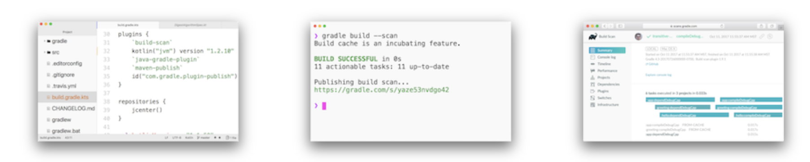

[[spring-boot-reference-documentation]]
= Gradle 用户手册 中文文档
Jcohy
include::attributes.adoc[]

TIP: 原文链接: https://docs.gradle.org/[https://docs.gradle.org/]

== Gradle 用户手册

TIP: 是否想了解顶级工程团队用来保持构建快速和高性能的提示和技巧？ https://gradle.com/training/build-cache-deep-dive/?bid=docs-userguide&_ga=2.213005527.2139717225.1602583090-1712392972.1602583090[在此处注册] 以获取我们的构建缓存培训。

Gradle 是专注于灵活性和性能的开源构建自动化工具。 Gradle 构建脚本是使用 {groovy}[Groovy] 或 {kotlin}[Kotlin] DSL编写的。阅读有关 {gradle-features}[Gradle 特性] 的信息，以了解 Gradle 的功能。

* 高度可定制 - Gradle以最基本的方式可定制和可扩展的方式建模。
* 快速 - Gradle通过重新使用以前执行的输出，仅处理已更改的输入以及并行执行任务来快速完成任务。
* 强大 - Gradle是Android的官方构建工具，并支持许多流行的语言和技术。

=== Gradle 新项目

Gradle 入门很容易！首先，按照我们的指南 <<user-manual.adoc#manual-install,下载并安装Gradle>>，然后查看 https://gradle.org/guides/#getting-started[Gradle 入门指南] 以创建您的第一个版本。

如果您当前正在使用 Maven，请查看 https://gradle.org/maven-vs-gradle/[Gradle vs Maven] 的直观对比，并按照从 <<user-manual.adoc#manual-Migrating-from-maven,Maven 迁移到 Gradle >> 的指南进行操作。

=== 使用现有的 Gradle 构建

Gradle 支持许多主要的 IDE，包括 Android Studio, Eclipse, IntelliJ IDEA, Visual Studio 2019, 和 XCode。
您还可以通过终端中的 <<reference#reference-command,命令行接口>>或持续集成服务器来调用 Gradle。 https://scans.gradle.com/?_ga=2.179903079.2139717225.1602583090-1712392972.1602583090[Gradle 构建扫描]可帮助您了解构建结果，提高构建性能并协作以更快地解决问题。

=== 获得帮助

* 论坛 - 获得帮助的最快方法是通过 https://discuss.gradle.org[Gradle 论坛]。社区成员和核心贡献者回答您的问题。
* 培训 - Gradle 开发人员每月都会进行免费的基于 Web 的 Gradle 培训。https://gradle.com/training/[前往培训页面]进行注册。
* 企业服务 - 支持和培训可以与 https://gradle.com[Gradle Enterprise] 订阅一起购买。

=== 许可证

Gradle 构建工具的源代码是开放的，并根据 https://github.com/gradle/gradle/blob/master/LICENSE[Apache License 2.0] 获得许可。 Gradle 用户手册和 DSL 参考已获得 https://creativecommons.org/licenses/by-nc-sa/4.0/[Creative Commons Attribution-NonCommercial-ShareAlike 4.0 国际许可的许可]。

include::about.adoc[]
include::getting-start.adoc[]
include::upgrading-migrating.adoc[]
include::running-gradle-builds.adoc[]
include::authoring-gradle-builds.adoc[]
include::dependency-management.adoc[]
include::java-jvm-projects.adoc[]
include::c++-native-projects.adoc[]
include::native-projects-using-software-model.adoc[]
include::extending-gradle.adoc[]
include::reference.adoc[]
include::plugins.adoc[]
include::license-information.adoc[]