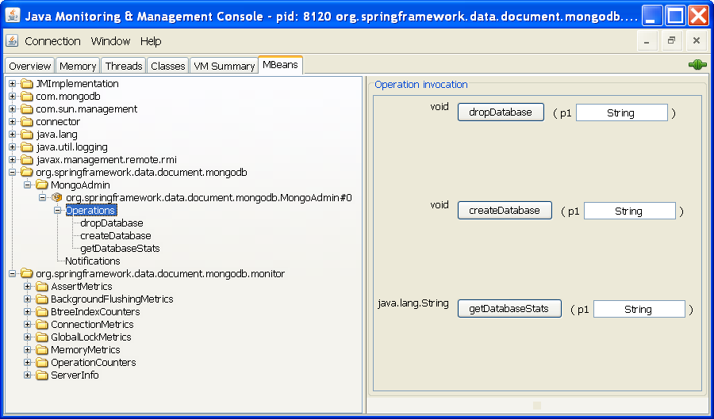

[[mongo.jmx]]
= JMX 支持

对 MongoDB 的 JMX 支持暴露了在单个 MongoDB 服务器实例的管理数据库上运行 'serverStatus' 命令的结果。它还公开了一个管理 MBean，即 `MongoAdmin`，让你执行管理操作，如删除或创建一个数据库。JMX 功能建立在 Spring 框架中可用的 JMX 功能集之上。更多细节见 https://docs.spring.io/spring/docs/{springVersion}/spring-framework-reference/integration.html#jmx[这里]。

[[mongodb:jmx-configuration]]
== MongoDB JMX 配置

Spring 的 Mongo 命名空间可以让你启用 JMX 功能，如下例所示。

.配置 MongoDB 的 XML schema
====
[source,xml]
----
<?xml version="1.0" encoding="UTF-8"?>
<beans xmlns="http://www.springframework.org/schema/beans"
  xmlns:xsi="http://www.w3.org/2001/XMLSchema-instance"
  xmlns:context="http://www.springframework.org/schema/context"
  xmlns:mongo="http://www.springframework.org/schema/data/mongo"
  xsi:schemaLocation="
    http://www.springframework.org/schema/context
    https://www.springframework.org/schema/context/spring-context-3.0.xsd
    http://www.springframework.org/schema/data/mongo
    https://www.springframework.org/schema/data/mongo/spring-mongo-1.0.xsd
    http://www.springframework.org/schema/beans https://www.springframework.org/schema/beans/spring-beans-3.0.xsd">

    <!-- Default bean name is 'mongo' -->
    <mongo:mongo-client host="localhost" port="27017"/>

    <!-- by default look for a Mongo object named 'mongo' -->
    <mongo:jmx/>

    <context:mbean-export/>

    <!-- To translate any MongoExceptions thrown in @Repository annotated classes -->
    <context:annotation-config/>

    <bean id="registry" class="org.springframework.remoting.rmi.RmiRegistryFactoryBean" p:port="1099" />

    <!-- Expose JMX over RMI -->
    <bean id="serverConnector" class="org.springframework.jmx.support.ConnectorServerFactoryBean"
        depends-on="registry"
        p:objectName="connector:name=rmi"
        p:serviceUrl="service:jmx:rmi://localhost/jndi/rmi://localhost:1099/myconnector" />

</beans>
----
====

前面的代码暴露了几个 MBean:

* `AssertMetrics`
* `BackgroundFlushingMetrics`
* `BtreeIndexCounters`
* `ConnectionMetrics`
* `GlobalLockMetrics`
* `MemoryMetrics`
* `OperationCounters`
* `ServerInfo`
* `MongoAdmin`

下面是 JConsole 的截图，显示了所产生的配置。

