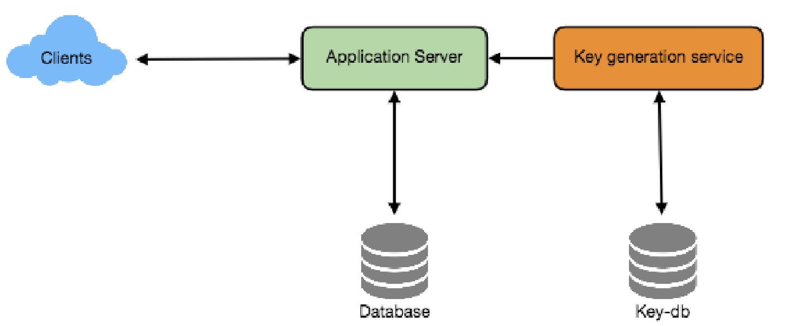

= Designing a URL Shortening service like TinyURL

= 设计类似TinyURL的短URL服务

让我们设计一个类似TinyURL的短URL服务。这个服务会将短的别名重定向到长的URL上。类似的服务有：bit.ly、goo.gl、qlink.me等等。困难等级：简单。

== 1.为什么需要简短的URL?

URL压缩服务用于为长URL创建一个更短的别名。我们将这些缩短的别名称之为"短链接"。当用户点击这些短链接时，他们会被重定向到原始的URL上。当在展示、打印、传输或者发推文时，短链接节省了很大的空间。此外，用户很少输错短链接。

例如，我们通过TinyURL缩短这个页面的URL：

https://www.educative.io/collection/page/5668639101419520/5649050225344512/5668600916475904/

我们将得到:

http://tinyurl.com/jlg8zpc

压缩后的URL大约是原始URL的三分之一大小。

URL压缩用于优化设备之间的链接，跟踪单个链接来分析受众和运行性能，并且隐藏相关联的原始URL。

如果你以前没有用过http://tinyurl.com[tinyurl.com]，请尝试创建一个新的压缩URL，并花费一些时间了解网站提供的不同的选项。这有助于你明白这章的内容。

== 2.系统需求和目标

[NOTE]
_你应该在面试开始时阐明系统的需求。确保面试官提出的问题在系统的确切范围之内。_

我们的URL压缩系统应该会有一下需求：

*功能性需求：*

1. 我们系统应该为给定的URL生成一个更短的且唯一的别名。这称之为短链接。
2. 当用户访问短链接时，我们的系统应该将它们重定向到原始URL链接上。
3. 用户应该可以为其URL自定义短链接名。
4. 链接将在默认时间后过期。用户可以指定过期时间

*非功能性需求：*

1. 系统应该高可用。 这是因为，如果服务宕机，那么所有的URL重定向将会失败。
2. URL重定向应该以最小的延迟时间实时进行。
3. 短链接不应该让人猜到（不可预测的）

*扩展需求：*

. 分析；例如，URL重定向发生了多少次？
. 其他服务也可以通过REST APIs访问我们的服务。

== 3.容量估计和约束

我们的系统将会是工作繁重的。与新的URL压缩相比，会有很多重定向的请求。假设读请求和写请求的比率为100：1。

**流量估算：**假设，我们每月有500M个新的压缩URL，以100：1的读写比来计算，这一时期内我们预计有50B个URL重定向：

[source,text]
----
100 * 500M => 50B
----

我们系统的每秒查询数量（QPS）是多少？每秒新URL压缩是：

[source,text]
----
5,000,000,000 / (30 天 * 24 时 * 3600 秒) = ~200 URLs/s
----

考虑到100：1的读/写比，每秒URL重定向是：

[source,text]
----
100 * 200 URLs/s = 20K/s
----

存储空间估算：假设我们将每条URL压缩请求（及其相关的短链接）存储5年。因为我们每月有5亿个新的URL，因此我们希望存储的对象总数是30亿。

[source,text]
----
500 million * 5 years * 12 months = 30 billion
----

假设存储的对象每个大约是500字节（只是一个大概的预估，稍后我们将对其深入研究），我们将需要15TB的存储空间：

[source, text]
----
30 billion * 500 bytes = 15 TB
----

带宽预估：对于写请求，因为我们预估每秒有200个新的URL，所以我们的服务接收到的数据总量是每秒100KB：

[source, text]
----
200 * 500 bytes = 100 KB/s
----

对于读请求，因为我们预估每秒有20K个URL重定向，所以我们的服务总传出的数据量是每秒10MB：

[source, text]
----
20K * 500 bytes = ~10 MB/s
----

内存估算：如果我们想要缓存一些频繁访问的热点URL，我们将需要多大的内存来存储它们呢？如果我们遵循2-8法则，即20%的URL产生80%的流量，我们将会缓存20%的热点URL。

因为每秒有2万个请求，所以一天大约会有17亿个请求。

[source, text]
----
20K * 3600 seconds * 24 hours = ~1.7 billion
----

为了缓存20%的请求URL，我们将需要170GB大小的内存。

[source, text]
----
0.2 * 1.7 billion * 500 bytes = ~170GB
----

要注意的是，因为将会有大量重复的请求（相同的URL），因此，我们实际使用的内存将小于170GB。

*高层级预估：* 假设每月有5亿个新的URL，和100：1的读写比，以下是我们服务的高层级预估的概览：

[source, text]
----
New URLs 200/s
URL redirections 20K/s
Incoming data 100KB/s
Outgoing data 10MB/s
Storage for 5 years 15TB
Memory for cache 170GB
----

== 4.系统APIs
[NOTE]
_一旦我们整理完需求，定义系统API是一个很好的选择。应该显示地声明系统期望的内容。_

我们可以使用SOAP或REST API对外暴露我们服务的功能。以下定义的API用于创建和删除URL：

[source, text]
----
createURL(api_dev_key, original_url, custom_alias=None, user_name=None,
expire_date=None)
----

*参数：*
api_dev_key (string)：注册账户的API开发者密钥。此外，这还用于根据分配的配额限制用户。

original_url (string): 被压缩的原始URL。

custom_alias (string): URL的可选的自定义值。

user_name (string): 编码中使用的可选的用户名。

expire_date (string): 压缩URL可选的过期时间。

*返回值： (string)*
成功新增后返回压缩的URL；否则，返回错误码。

[source, text]
----
deleteURL(api_dev_key, url_key)
----

“url_key”表示一个可被检索的压缩URL字符串。成功删除后将返回“URL Removed”。

*我们如何检测和防止数据滥用？* 在当前的设计中，恶意用户可以通过消耗所有的URL密钥来迫使我们破产。为了防止数据滥用，我们可以通过用户的api_dev_key来限制用户。每一个api_dev_key可以限制URL的创建数量和一段时间内URL重定向的数量（可以为每个开发者的密钥设置不同的时间段）。

== 5. Database Design
[NOTE]
在面试的早期阶段定义数据库模式将有助于理解不同组件之间的数据流，之后会指导数据分区。

关于我们将存储的数据的性质的一些观察如下：

. 我们需要存储数十亿条记录。
. 存储的每个对象都很小（小于1K）。
. 记录与除了存储创建URL的用户有关联，与其他的记录是没有关系的。
. 我们的服务是包含大量读操作的。

*数据库模式：*
我们需要两张表：一个用于存储URL映射的相关信息，一个存储创建短链接的用户数据。

*我们使用哪种数据库呢？* 因为我们预计要存储数十亿行数据，并且我们不需要使用对象之间的关系，NoSQL的键值对存储，如 https://en.wikipedia.org/wiki/Amazon_DynamoDB[DynamoDB] 、 https://en.wikipedia.org/wiki/Apache_Cassandra[Cassandra] 或 https://en.wikipedia.org/wiki/Riak[Riak] 都是一个很好的选择。选择使用NoSQL也更容易扩展。详情请参考 https://www.educative.io/collection/page/5668639101419520/5649050225344512/5728116278296576/[SQL vs NoSQL]。

== 6. 基本系统设计与算法
本节要解决的问题是，如何为给定的URL生成一个短的且唯一的值。

在第一章的TinyURL例子中，压缩的URL是“http://tinyurl.com/jlg8zpc”。这个URL的最后6位字符是我们想生成的短值。我们在这提供了两种解决方案：

=== 6.1. 编码实际的URL

我们计算给定URL的唯一hash值（如： https://en.wikipedia.org/wiki/MD5[MD5] 或者 https://en.wikipedia.org/wiki/SHA-2[SHA256] 等）。然后对hash值进行编码以进行展示。这种编码可以是base36（[a-z, 0-9]）或者base62([A-Z, a-z, 0-9])，并且如果我们添加‘-’和‘.’，那么我们可以使用base64编码。一个合理的问题是，压缩键的长度应该是几个字符？6个、8个或者10个字符。

使用base64编码，一串6个字母长的键将生成64^6=约687亿种不同的字符串。
使用base64编码，一串8个字幕长的键将生成64^8=约281万亿种不同的字符串。

假设有687亿种唯一字符串，那么6个字母的足以满足我们的系统。

如果我们使用MD5算法作为hash函数，它将会生成一个128位的hash值。base64编码后，我们将得到一个包含21个以上字符的字符串（因为每个base64编码的字符都有6位的哈希值）。因此每个压缩值只有8个字符的空间，那么我们改如何选择键呢？我们可以将前6或者8个字母作为键。但是，这可能导致键重复，在此基础上，我们可以从编码字符串中选择一些其他的字符或者交换一些字符。

*我们的解决方案有哪些不同的问题呢？* 我们的编码方案有以下两个问题：

1. 如果多个用户输入同一个URL，他们会得要相同的压缩URL，这是不可接受的。
2. 如果URL的某部分已经被编码了，该怎么办？比如： http://www.educative.io/distributed.php?
id=design, and http://www.educative.io/distributed.php%3Fid%3Ddesign 除URL编码之外，其他的均相同。

*问题的解决方法：* 我们可以在每个输入的URL后追加一个递增的序列号，以使其唯一，然后生成一个哈希值。不过，我们无需把此序列号存储到数据库。这个方法的问题是序列号会不断的增加，它会溢出吗？追加递增的序列号也会影像服务的性能。

另一种解决方案是可以追加用户ID（应该是唯一的）到输入的URL上，如果用户没有登录，那么必须让用户选择一个唯一值。即使在此之后，如果发生冲突，我们也必须生成键，直到获得一个唯一的键值。

=== 6.2. 离线生成密钥
我们可以拥有一个独立的密钥生成服务（KGS），该服务可以预先生成随机的六个字母并将其存储到数据库中（我们称之为密钥数据库）。每当我们想要压缩URL时，我们将会获取某个已经生成的密钥并使用它。这种方法会使用URL压缩变得简单、快捷。我们不但不用编码URL，而且不必担心重复和冲突问题。KGS将会确保所有新增到数据库的密钥是唯一的。

*并发会导致问题吗？* 一旦一个密钥被使用，应在数据库中对其进行标记，确保它不会再次被使用。如果有多个服务同时读取密钥，可能会发生这样一种情况，两个或多个服务试图从数据库中读取同一个密钥。该如何解决这个并发问题呢？

服务器会使用KGS读取/标记数据库中的密钥。KGS可以使用两个表存储密钥：一个表存储没有使用过的密钥，一个表存储所有使用过的密钥。一旦KGS将密钥提供给某一个服务器，它将会把密钥移动到被使用过的密钥表中。KGS总会存储一些密钥在内存中，以便于当某个服务需要他们时，可以很快地获取到密钥。

为了简单起见，一旦KGS将密钥加载到内存中，就可以将他们移动到被使用过的密钥表中。这确保每个服务器获取唯一的密钥。如果KGS在将所有已加载到内存的密钥分配给服务器之前宕机，那么我们将会浪费掉这些密钥-鉴于我们有大量的密钥，这个结果是可接受的。KGS也必须确保同一个密钥不会分配给多个服务器。为此，它必须同步持有（或锁定）密钥的数据结构，然后再把它分配给服务器并删除它。

*密钥数据库的大小是多少？* 使用base64编码，我们将生成68.7B个唯一的六位字母的密钥。如果我们需要一个字节存储一个字母数字的字符，则可以将所有的字符存储在：

[source,text]
----
6 (characters per key) * 68.7B (unique keys) = 412 GB.
----

KGS是不是一个单点故障吗？是的，它是单点故障。为了解决这个问题，我们可以添加KGS的备份副本。每当主服务宕机时，备份服务可以接管主服务生成并提供密钥。每个应用服务器可以缓存密钥数据库的数据吗？是的，这可以加快服务提供的速度。虽然在这种情况下，应用服务器在消耗完所有密钥之前宕机时会丢失这些密钥。但这是可以接收的，因为我们有680亿个唯一的6个字符的密钥。我们将如何执行键查找？我们可以在数据库或者键值存储中查找密钥，以获取完整的URL。如果URL存在，发送“HTTP 302 Redirect”状态到浏览器，并在存储的URL设置到请求中的“Location”字段中进行传递。如果在系统中没有找到这个密钥，发送一个“HTTP 404 Not Found”状态或者将用户重定向到首页。我们应该对自定义别名设置大小限制吗？我们的服务支持自定义别名。用户可以选择自己喜欢的任何“键”，但提供自定义别名不是强制的。但是，限制自定义别名的大小是合理的（并且通常是值得做的），以确保我们拥有一致的URL数据库。假设用户可以为每个客户密钥指定最多16个字符（如上述数据库架构所示）。

URL压缩的高级系统设计

== 7. 数据分区和备份

为了扩展我们的数据库，我们需要对数据库进行分区，以便可以存储数十亿条URL。我们需要提出一个分区方案，将数据划分并存储到不同的数据库服务器中。

.. *基于范围的分区：* 我们可以基于URL的首字母或者哈希值将URL存储到单独的分区中。因此，以字母‘A’开头的所有URL存储在一个分区中，以字母‘B’开头的所有URL存储在一个分区中，以此类推。这种方法成为之基于范围的分区。我们甚至可以将不常出现的字母开头的URL存储到同一个数据库分区中。我们应该提出一个静态分区方案，以便于我们始终可以以可预测的方式存储或发现文件。

这种方法的主要问题是会导致数据不均衡。例如：我们决定把所有以字母‘E’开始的URL存储到一个数据库分区，但是随后我们发现有大量的以字母‘Ｅ’开始的URL。

.. *基于Hash的分区：* 在这个方案中，我们对存储对象的进行哈希处理。然后，我们根据哈希值计算要使用哪个分区。在我们的例子中，我们可以使用‘key’或者实际URL的哈希值来决定使用哪个分区来存储数据对象。

哈希函数会将URL随机地分配到不同的分区中（例如：哈希函数总是映射任意密钥到１－６的之间数字中），并且该数字代表我们储存对象的分区。

这种方法仍热会导致分区过载，可以使用　https://www.educative.io/collection/page/5668639101419520/5649050225344512/5709068098338816/[一致性哈希]　来解决这个问题。

== 8. Cache

We can cache URLs that are frequently accessed. We can use some off-the-shelf solution like Memcache, which can store full URLs with their respective hashes. The application servers, before hitting backend storage, can quickly check if the cache has the desired URL.

*How much cache should we have?* We can start with 20% of daily traffic and, based on clients’ usage pattern, we can adjust how many cache servers we need. As estimated above, we need 170GB memory to cache 20% of daily traffic. Since a modern-day server can have 256GB memory, we can easily fit all the cache into one machine. Alternatively, we can use a couple of smaller servers to store all these hot URLs.

*Which cache eviction policy would best fit our needs?* When the cache is full, and we want to replace a link with a newer/hotter URL, how would we choose? Least Recently Used (LRU) can be a reasonable policy for our system. Under this policy, we discard the least recently used URL first. We can use a https://docs.oracle.com/javase/7/docs/api/java/util/LinkedHashMap.html[LinkedHashMap] or a similar data structure to store our URLs and Hashes, which will also keep track of the URLs that have been accessed recently.

To further increase the efficiency, we can replicate our caching servers to distribute load between them.

*How can each cache replica be updated?* Whenever there is a cache miss, our servers would be hitting a backend database. Whenever this happens, we can update the cache and pass the new entry to all the cache replicas. Each replica can update their cache by adding the new entry. If a replica already has that entry, it can simply ignore it.

== 9.Load Balancer (LB)

We can add a Load balancing layer at three places in our system:

. Between Clients and Application servers
. Between Application Servers and database servers
. Between Application Servers and Cache servers

Initially, we could use a simple Round Robin approach that distributes incoming requests equally among backend servers. This LB is simple to implement and does not introduce any overhead. Another benefit of this approach is that if a server is dead, LB will take it out of the rotation and will stop sending any traffic to it.

A problem with Round Robin LB is that server load is not taken into consideration. If a server is overloaded or slow, the LB will not stop sending new requests to that server. To handle this, a more intelligent LB solution can be placed that periodically queries the backend server about its load and adjusts traffic based on that.

== 10. Purging or DB cleanup

Should entries stick around forever or should they be purged? If a user-specified expiration time is reached, what should happen to the link?

If we chose to actively search for expired links to remove them, it would put a lot of pressure on our database. Instead, we can slowly remove expired links and do a lazy cleanup. Our service will make sure that only expired links will be deleted, although some expired links can live longer but will never be returned to users.

* Whenever a user tries to access an expired link, we can delete the link and return an error to the user.
* A separate Cleanup service can run periodically to remove expired links from our storage and
cache. This service should be very lightweight and can be scheduled to run only when the user traffic is expected to be low.
* We can have a default expiration time for each link (e.g., two years).
* After removing an expired link, we can put the key back in the key-DB to be reused.
* Should we remove links that haven’t been visited in some length of time, say six months? This
could be tricky. Since storage is getting cheap, we can decide to keep links forever.

Detailed component design for URL shortening

== 11. Telemetry

How many times a short URL has been used, what were user locations, etc.? How would we store these statistics? If it is part of a DB row that gets updated on each view, what will happen when a popular URL is slammed with a large number of concurrent requests?

Some statistics worth tracking: country of the visitor, date and time of access, web page that refers the click, browser, or platform from where the page was accessed.

== 12.Security and Permissions

Can users create private URLs or allow a particular set of users to access a URL?

We can store permission level (public/private) with each URL in the database. We can also create a separate table to store UserIDs that have permission to see a specific URL. If a user does not have permission and tries to access a URL, we can send an error (HTTP 401) back. Given that we are storing our data in a NoSQL wide-column database like Cassandra, the key for the table storing permissions would be the ‘Hash’ (or the KGS generated ‘key’). The columns will store the UserIDs of those users that have permissions to see the URL.
