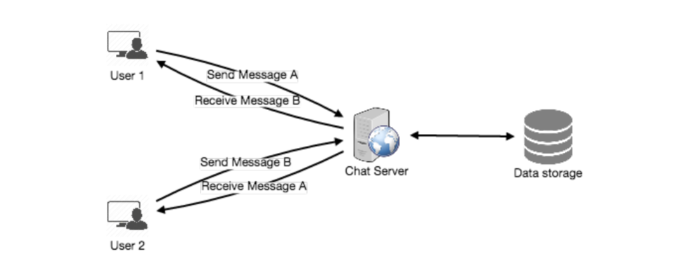

让我们来设计一个即时消息服务，比如：Facebook Messenger，用户可以通过网页应用或者手机应用互相发送文本信息。

== 1. 什么是Facebook Messenger？

Facebook Messenger是一个软件应用程序，它给它的用户提供了基于文本信息的即时消息服务。Messenger用户可以通过facebook网站以及手机端应用与他们的朋友聊天。

== 2. 系统的需求和目标

我们的Messenger需要满足以下要求：

==== 功能性需求：

<1> Messenger应该支持用户之间一对一会话。
<2> Messenger应该保持用户状态（在线/离线）展示。
<3> Messenger应该支持聊天记录的持久化存储。

==== 非功能性需求：

<1> 用户应该具有最小延迟的实时聊天体验。
<2> 我们的系统应该高一致性；用户应该能够看到他们相同的聊天记录在他们所有的设备上。
<3> Messenger的高可用是需要的；我们可以为了消息的一致性，容忍较小的可用性。

==== 拓展性需求:

 * 组聊天：Messenger应该支持多用户在同一个群组中互相聊天。
 * 通知推送：Messenger应该能够在用户离线的情况下通知用户有一条新消息。

== 3.容量预估以及约束

假设我们有5亿日活量用户以及每天平均每个用户发送40条消息；这样我们每天就需要存储200亿条消息。

存储容量预估：假设平均每条消息占用100 bytes，所以每天存储所有的消息，我们需要2TB的存储容量。

`200亿条消息 * 100 bytes => 2TB/天`

存储5年的聊天记录，我们就需要3.6 PB的存储容量。

`2TB * 365天 * 5年 ~= 3.6PB`

除了这些聊天记录，我们也需要存储用户的信息，消息元数据（ID，时间戳（Timestamp）等等）。

更何况上述计算没有考虑数据压缩以及复制的情况。

*带宽预估：* 如果我们的服务每天收到2TB的数据，这将需要我们提供25MB/s的上传数据的速度。

2TB / 86400秒 ~= 25MB/s

因为每条上传的消息需要我们发送给另一个用户，所以我们需要相同带宽（25MB/s）用于消息的上传和下载。

*高级预估：*

每天总量200亿条消息、每天2TB数据存储、五年3.6PB数据存储、上传数据速度25MB/s、下载数据速度25MB/s

== 4.高级设计

从高层面来讲，我们需要一个聊天服务器作为中心部分，协调用户之间的所有通信。当用户想给另一个用户发送消息时，他们需要连接到聊天服务器并且发送消息给服务器；然后服务器将这个消息发送给另一个用户并且也将内容存储在数据库中。

详细工作流程如下所示：

<1> 用户A通过聊天服务器发送一条消息给用户B
<2> 服务器接收到消息并且向用户B发送一个ACK确认
<3> 服务器将消息存储到数据库.并且将这条消息发送给用户B
<4> 用户B接收到消息并向服务器发送ACK确认
<5> 服务器通知用户A，消息已经成功发送给用户B

发送消息的请求流程

== 5. 组件详细设计

首先让我尝试构建一个简单的解决方案，所有服务运行在一台服务器上，在高级别用例中，我们系统需要解决以下问题:

<1> 接收消息和发送消息；
<2> 存储消息到数据库以及从数据库中检索信息；
<3> 记录用户对的在线和离线状态，并且通知所有与该用户相关的用户状态的变化。

=== a. 消息处理
==== 我们如何能够高效的收/发消息？

发送消息，一个用户需要连接到服务器并且传递消息给另一个用户。从服务器获取信息，用户有两个选项：

<1> 拉取模型：用户可以定期请求服务器是否有新消息。
<2> 推送模型：用户可以与服务器保持连接打开，并且可以依赖服务器在出现新消息通知用户。

如果我们采用第一个方法，那么这个服务器需要保持追踪等待被发送的消息，并且一旦接收用户向连接的服务器索要新消息，服务器能够返回所有挂起的消息。为了让用户获取消息最小延迟，他们不得不频繁的向服务器请求检查，如果他们没有挂起的消息，大多数时间他们都是拿到一个空响应。这将浪费很多资源并且看起来并不是一个有效的解决方案。

如果我们采用第二种方法，所有在线用户都与服务器保持连接，那么一旦服务器接收到一条消息，它就能立即向预期的用户发送消息。这种方式，服务器不需要一直追踪挂起的消息，并且我们将会得到最小的延迟，因为消息会立即在打开的连接中发送到用户。

==== 如何让客户端与服务器保持连接打开？
我们可以使用HTTP的长轮询或websocket。在长轮询中，客户端可以向服务器请求信息，但是服务可能不会立即响应。 如果服务器接收到轮询信息，但是没有新数据，转而发送一个空响应给客户端，服务器保持这个请求打开以及等待可得到的响应消息。一旦服务器有了新消息，服务器会立即将信息发送给客户端完成这次请求。在收到服务器的响应后，客户端会立即向服务器发起另一个请求为将来的更新准备。这在延迟、吞吐量和性能方面有很大的改进。长轮询请求可能会超时也可能接收到一个与服务器断开的连接，在这种情况下，客户端需要打开一个新的请求。

==== 服务器如何追踪打开的所有连接并且有效的重定向将消息发送到对应的用户？
服务器保留了一个哈希表，“key”是用户ID，"value"是连接对象。所以无论服务器何时接收到用户的消息，服务器都能在哈希表中找到该用户的的连接对象，并且在打开的请求中发送消息。

==== 当服务器接收到一条来自用户的用户消息，接收方离线会发生什么？
如果接收方失去与服务器断开连接，服务器会通知发送方消息发送失败。如果只是临时断开连接，那么我们应该期待重新连接到接收方，比如：这个接收方的长轮询请求只是超时。在这个例子中，我们可以让发送方重新发送这条消息。这个重试操作可以内嵌在客户端程序逻辑中，所以用户就不需要重新输入消息了。服务器也可以保存这消息一会并且一旦接收方重新连接再重新将消息发送到接收方。

==== 我们需要多少的聊天服务器？
我们预估再任意时间都有5亿连接在线。假设现代服务器可以随时处理5万个并发连接，那么我们需要一万台服务器。

==== 我们如何准确的知道哪台服务器与哪个用户保持着连接？
我们可以在我们的聊天服务器前面引入软件负载均衡，这样我们就可以将用户ID映射到对应的服务器来重定向请求。
