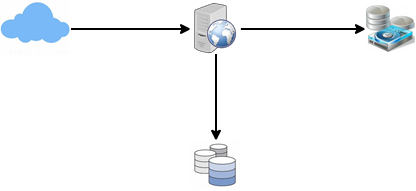
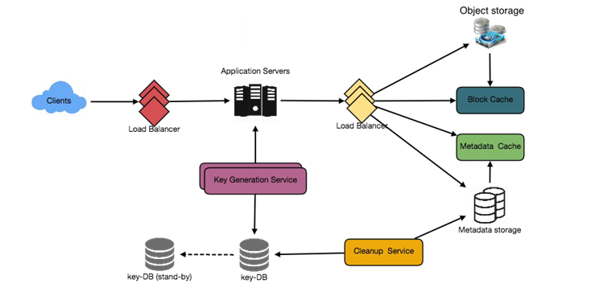

== 设计Pastebin

让我们设计一个类似Pastebin的Web服务，用户可以在其中存储普通的文本。该服务的用户将会输入一段文本并获得一个随机生成的URL来访问它。类似的服务有：pastebin.com, pasted.co, chopapp.com。难度级别：简单。

=== 1. 什么是Pastebin?

类似Pastebin的服务可以使用户通过网络（通常是Internet）存储普通文本或者图片，并生成唯一的URL来访问上传的数据。此类服务还可以通过互联网快速分享数据，因为用户只需要传递URL即可让其他用户看到数据。

如果你之前没有使用过pastebin.com，请尝试在此网站上创建一个新的‘Paste’，并花费一点儿时间浏览该服务提供的各种选项。这将有助于你理解本章内容。

=== 2. 系统需求和目标

我们的Pastebin服务应该满足以下需求：

功能性需求：::

. 用户应该可以上传或者“粘贴”他们的数据，并获取一个唯一的URL来访问它。
. 用户只能上传文本数据。
. 数据和链接将会在特定时间段之后自动过期；用户应该也可以指定过期时间。
. 用户应该也可以选择为其粘贴的数据指定别名。

非功能性需求：::

. 系统应该高可靠，上传的数据应不会丢失。
. 系统应该高可用。这是必需的，因为如果我们的服务宕机，那么用户将不能访问他们的Pastes。
. 用户应该可以在最小延迟时间内即时访问他们的数据。
. Paste的链接不应该用户被猜测到（不可预测的）。

扩展需求：::

. 分析。比如：一个链接被访问了多少次？
. 其他服务应该可以通过REST APIs访问我们的服务。

=== 3. 设计注意事项

Pastebin和URL压缩服务的一些需求相同，但是还有一些我们应该牢记的其他设计事项。

用户一次粘贴的文本数量的限制应该是多少？我们可以限制用户粘贴的数据大小不超过10MB，以防止用户滥用服务资源。

我们应该对自定义网址设置大小限制吗？由于我们的服务支持自定义URL，因此用户可以选择他们喜欢的任何URL，但是并非必须提供自定义URL。然而，对自定义URL限制大小是合理的（并且通常是可取的），以便我们拥有一致的URL数据库。

=== 4. 容量估算和约束

我们的服务将会有大量的读请求；相比于新的Paste的创建，会有更多的读请求。假如读请求和写请求的比例是5：1.

*流量估算*：Pastebin服务不期望流量和Twitter或者Facebook一样多，假设每天有一百万个新的paste新增到我们的系统中。这使我们每天有5百万次读请求。

每秒创建新的Paste：

[source,text]
====
    1,000,000 / (24小时 * 3600秒) ~= 12 pastes/sec
====

每秒读paste：

[source,text]
====
    5,000,000 / (24 hours * 3600 seconds) ~= 58 reads/sec
====

*存储估算：* 用户最多可以上传10MB的数据；通常，类似Pastebin的服务用户共享源代码、配置或者日志。这样的文字不是很大，假设每次粘贴平均包含10KB的数据。

按照这个速率，每天将存储10GB的数据。

[source,text]
====
    1M * 10KB => 10 GB/day
====

如果我们想将这些数据存储10年，那么我们将需要36TB的总存储容量。

每天1百万次的数据粘贴，那么10年将会有36亿次的数据粘贴。我们需要为这些数据生成并存储唯一识别的键。如果使用Base64编码（[A-Z, a-z, 0-9, ., -]）,将需要6个字母的字符串：

[source,text]
====
    64^6 ~= 68.7 billion unique strings
====

如果一个字节存储一个字符，存储36个键的总空间大小为：

[source,text]
====
    3.6B * 6 => 22 GB
====

22GB与36TB相比可以忽略不急。为了留有余地，我们将采用70%模型（意味着在任何时候我们都不希望使用总存储容量的70%以上的空间），这将会把存储空间的大小提升到51.4TB。

*带宽预估：* 对于一个写请求来说，我们期望每秒有12个新的粘贴数据，从而导致每秒有120KB大小的数据增长。

[source,text]
====
    12 * 10KB => 120 KB/s
====

对于读请求，我们期望每秒有个58个请求。因此，传出的总数据（发送给用户）是0.6MB/s。

[source,text]
====
    58 * 10KB => 0.6 MB/s
====

虽然每秒总出入的数据不大，但是我们设计服务时应该牢记这些数据。

*内存预估：* 我们可以缓存一些频繁访问的热点paste数据。根据80-20原则，意味着20%的热点paste数据将产生80%的流量，我们想要缓存这20%的paste数据。

因为每天有5百万个读请求，因为缓存这些请求的20%，需要的空间大小是：

[source,text]
====
    0.2 * 5M * 10KB ~= 10 GB
====

=== 5. System APIs

We can have SOAP or REST APIs to expose the functionality of our service.
Following could be the definitions of the APIs to create/retrieve/delete Pastes:

addPaste(api_dev_key, paste_data, custom_url=None user_name=None, paste_name=None, expire_date=None) Parameters:
api_dev_key (string): The API developer key of a registered account.
This will be used to, among other things, throttle users based on their allocated quota.
paste_data (string): Textual data of the paste.
custom_url (string): Optional custom URL.
user_name (string): Optional user name to be used to generate URL. paste_name (string): Optional name of the paste expire_date (string): Optional expiration date for the paste.

Returns: (string) A successful insertion returns the URL through which the paste can be accessed, otherwise, it will return an error code.

Similarly, we can have retrieve and delete Paste APIs:

getPaste(api_dev_key, api_paste_key) Where “api_paste_key” is a string representing the Paste Key of the paste to be retrieved.
This API will return the textual data of the paste.

deletePaste(api_dev_key, api_paste_key) A successful deletion returns ‘true’, otherwise returns ‘false’.

=== 6. Database Design

A few observations about the nature of the data we are storing:

1. We need to store billions of records.
2. Each metadata object we are storing would be small (less than 100 bytes).
3. Each paste object we are storing can be of medium size (it can be a few MB).
4. There are no relationships between records, except if we want to store which user created what Paste.

5. Our service is read-heavy.

Database Schema:

We would need two tables, one for storing information about the Pastes and the other for users’ data.

Paste

User

pPK >URLHash: varchar(16) <spPaKn>UserID: int

pan>ContentKey: varchar(512)Name: varchar(20) pan>ExpirationDate: datatimeEmail: varchar(32)

ot supported by viewer] pan>CreationDate: datetime

CreationDate: datetime 

LastLogin: datatime

Here, ‘URlHash’ is the URL equivalent of the TinyURL and ‘ContentKey’ is the object key storing the contents of the paste.

=== 7. High Level Design

At a high level, we need an application layer that will serve all the read and write requests.
Application layer will talk to a storage layer to store and retrieve data.
We can segregate our storage layer with one database storing metadata related to each paste, users, etc., while the other storing the paste contents in some object storage (like Amazon S3).
This division of data will also allow us to scale them individually.

Metadata storage

=== 8. Component Design

a. Application layer

Our application layer will process all incoming and outgoing requests.
The application servers will be talking to the backend data store components to serve the requests.

How to handle a write request?
Upon receiving a write request, our application server will generate a six-letter random string, which would serve as the key of the paste (if the user has not provided a custom key).
The application server will then store the contents of the paste and the generated key in the database.
After the successful insertion, the server can return the key to the user.
One possible problem here could be that the insertion fails because of a duplicate key.
Since we are generating a random key, there is a possibility that the newly generated key could match an existing one.
In that case, we should regenerate a new key and try again.
We should keep retrying until we don’t see failure due to the duplicate key.
We should return an error to the user if the custom key they have provided is already present in our database.

Another solution of the above problem could be to run a standalone Key Generation Service (KGS) that generates random six letters strings beforehand and stores them in a database (let’s call it key-DB).
Whenever we want to store a new paste, we will just take one of the already generated keys and use it.
This approach will make things quite simple and fast since we will not be worrying about duplications or collisions.
KGS will make sure all the keys inserted in key-DB are unique.
KGS can use two tables to store keys, one for keys that are not used yet and one for all the used keys.
As soon as KGS gives some keys to an application server, it can move these to the used keys table.
KGS can always keep some keys in memory so that whenever a server needs them, it can quickly provide them.
As soon as KGS loads some keys in memory, it can move them to the used keys table, this way we can make sure each server gets unique keys.
If KGS dies before using all the keys loaded in memory, we will be wasting those keys.
We can ignore these keys given that we have a huge number of them.

Isn’t KGS a single point of failure?
Yes, it is.
To solve this, we can have a standby replica of KGS and whenever the primary server dies it can take over to generate and provide keys.

Can each app server cache some keys from key-DB?
Yes, this can surely speed things up.
Although in this case, if the application server dies before consuming all the keys, we will end up losing those keys.
This could be acceptable since we have 68B unique six letters keys, which are a lot more than we require.

How does it handle a paste read request?
Upon receiving a read paste request, the application service layer contacts the datastore.
The datastore searches for the key, and if it is found, returns the paste’s contents.
Otherwise, an error code is returned.

b. Datastore layer

We can divide our datastore layer into two:

1. Metadata database: We can use a relational database like MySQL or a Distributed Key-Value store like Dynamo or Cassandra.
2. Object storage: We can store our contents in an Object Storage like Amazon’s S3. Whenever we feel like hitting our full capacity on content storage, we can easily increase it by adding more servers.

Detailed component design for Pastebin

=== 9. Purging or DB Cleanup

Please see Designing a URLShortening service.

=== 10.	Data Partitioning and Replication

Please see Designing a URLShortening service.

=== 11.	Cache and Load Balancer

Please see Designing a URLShortening service.

=== 12.	Security and Permissions

Please see Designing a URLShortening service.
