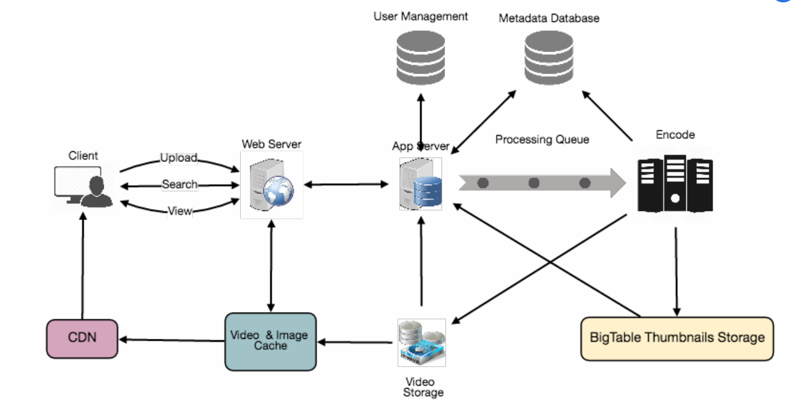

== 设计 Youtube or Netflix

让我们设计一个类似Youtube的视频分享网站，任何地方的用户将可以上传、浏览和搜索视频。类似的服务有：netflix.com, vimeo.com, dailymotion.com, veoh.com。难度等级为：中级。

[[为什么是youtube]]
=== 1. 为什么是 Youtube?

Youtube是全世界最受欢迎的视频分享网站之一。使用该服务的用户可以上传、查看、分享、评价和举报视频，也可以为视频写评论。

[[系统需求和目标]]
=== 2.系统需求和目标

为了便于练习，我们计划设计一个更简单的Youtube版本，具有以下要求：

*功能性需求：*

. 用户应该能上传视频；
. 用户应该能分享和查看视频；
. 用户应该能基于视频标题搜索视频；
. 系统应该能够记录视频的统计信息，比如，喜欢或不喜欢的数量、视频的播放量等；
. 用户应该能评价视频，并浏览其评论。

*非功能性需求：*

. 系统应该是高度可靠的，并且上传的视频不会丢失；
. 系统应该是高度可用的。为了可用性，系统一致性可能会受到影响，如果用户在短时间内无法查看视频，这是可接受的。
. 用户在观看视频时应该有实时体验感，并且不应该有任何延迟。

不在本次系统设计范围之内的功能：视频推荐、最受欢迎的视频、频道、订阅、稍后观看、收藏等等。

[[容量估计和约束]]
=== 3. 容量估计和约束

假设我们总共有15亿个用户，其中8亿日活跃用户。如果平均每个用户每天观看5个视频，那么每秒的视频播放数为：

[source,text]
====
    800M * 5 / 86400 sec => 46K videos/sec
====

假设视频上传和视频播放之比是1:200，比如，每上传一个视频就有200个视频被播放，因此每秒会有上传230个视频。

[source,text]
====
    46K / 200 => 230 videos/sec
====

*存储容量估计：* 假设每分钟会上传时长500小时的视频到 Youtube。平均一分钟的视频需要50MB大小的存储空间（视频需要存储为多种格式），每分钟上传的视频需要的总空间大小是：

[source,text]
====
    500 hours * 60 min * 50MB => 1500 GB/min (25 GB/sec)
====

这些数值是在忽略视频压缩和备份的情况下估计的，这将会影响我们的估值。

These numbers are estimated with ignoring video compression and replication, which would change our estimates.

*带宽估计：* 每分钟上传时长500小时的视频，假设上传每个视频需要10MB/分钟的带宽，每分钟将会获得 300GB 的上传量。

[source,text]
====
    500 hours * 60 mins * 10MB => 300GB/min (5GB/sec)
====

假设上传和播放的比率是1:200，那么需要1TB/s的传出带宽。

[[system-APIs]]
=== 4. 系统APIs

可以使用SOAP或者REST API对外暴露服务的功能。以下定义了上传和搜索视频的API：

uploadVideo(api_dev_key, video_title, vide_description, tags[], category_id, default_language, recording_details, video_contents)

*参数：*

. api_dev_key (string)：注册账户的API开发者密钥。除此之外，这将被用于根据分配的配额限制用户；
. video_title (string)：视频的标题；
. vide_description (string)：可选的视频的描述；
. tags (string[]): 可选的视频的标签；
. category_id (string)：视频的类别。比如电影、歌曲、人物等；
. default_language (string)： 例如英语、普通话、印度语等；
. recording_details (string)：录制视频的位置；
. video_contents (stream)： 上传的视频。

*返回值：* (string)成功上传将返回 HTTP 202（已接受请求），一旦视频编码完成，用户将通过电子邮件收到通知，其中包含访问视频的链接。我们还可以公开一个可查询的 API，让用户知道他们上传视频的当前状态。

searchVideo(api_dev_key, search_query, user_location, maximum_videos_to_return, page_token)

*参数：*

. api_dev_key (string): 注册账户的API开发者密钥;
. search_query (string): 包含搜索词的字符串；
. user_location (string): 用户执行搜索的可选位置；
. maximum_videos_to_return (number): 一个请求返回的结果的最大数；
. page_token (string): 此标记将指定结果集中应返回的页面。

*返回：* (JSON)一个 JSON，其中包含与搜索查询匹配的视频资源列表的信息。每个视频资源都有一个视频标题、一个缩略图、一个视频创建日期和一个观看次数。

streamVideo(api_dev_key, video_id, offset, codec, resolution)

*Parameters:*

. api_dev_key (string): 服务注册账号的API开发者密钥；
. video_id (string): 唯一标识视频的字符串；
. offset (number): 应该可以从任何偏移位置传递视频数据。这个偏移位置是从视频开始起的秒数。如果支持从多个设备播放或暂停视频，那么需要在服务器存储其偏移位置，即视频播放或暂停的秒数位置。这将是用户在任一设备上在同一个地方开始播放视频。
. codec (string) & resolution(string)：我们应该从客户端发送API中的编解码器和分辨率信息，以支持多个设备上的播放或暂停。想象下你正在电视上的Netflix应用观看视频，然后暂停视频，又开始在手机上的Netflix应用中继续观看这个视频。在这种情况下，你将需要编解码器和分辨率，因为两种设备具有不同的分辨率和使用不同的编解码器。

*返回：* (STREAM) 从给定的偏移位置开始的媒体流数据（视频块）.

[[高级设计]]
=== 5. 高级设计

在高层次上，我们需要以下组件：

. 处理队列：每个上传的视频将被推送到处理队列，以便稍后出列进行编码、缩略图生成和存储。
. 编码器：将每个上传的视频编码为多种格式。
. 缩略图生成器：为每个视频生成一些缩略图。
. 视频和缩略图存储：将视频和缩略图文件存储在一些分布式文件存储中。
. 用户数据库：用于存储用户的信息，例如姓名、电子邮件、地址等。
. 视频元数据存储：一个元数据数据库，用于存储有关视频的所有信息，如标题、系统中的文件路径、上传用户、总观看次数、喜欢、不喜欢等。它还将用于存储所有视频评论信息。

//TODO
image[]

Youtube的高级设计。

[[数据库模式]]
=== 6. 数据库模式

*视频元数据存储 - MySql*

视频元数据可以存储在关系型数据库。每个视频应该存储以下信息：

* VideoID
* 标题
* 描述
* 视频的大小
* 缩略图
* 上传者/用户
* 喜欢视频的总数
* 不喜欢视频的总数
* 浏览量

对于每一个视频评论，需要存储以下信息：

* CommentID
* VideoID
* UserID
* Comment
* TimeOfCreation

*用户数据存储 - MySql*

* UserID, Name, email, address, age, registration details etc.

[[detailed-component-design]]
=== 7. 组件详细设计

该服务的读取量很大，因此我们将专注于构建一个可以快速检索视频的系统。我们可以预期我们的读写比率为 200:1，这意味着每个视频上传会有 200 个视频播放。

*视频存储在哪里？* 视频会被存储在一个分布式文件存储系统种，比如 https://en.wikipedia.org/wiki/Apache_Hadoop#HDFS[HDFS] 或者 https://en.wikipedia.org/wiki/GlusterFS[GlusterFS].

*应该如何有效地管理读取流量？*
应该将读取流量与写入流量分开。由于我们拥有每个视频的多个备份，因此我们可以分配读取流量到不同的服务器。对于元数据，我们可以进行主从配置，其中写入将首先发送到主服务器，然后应用到所有从服务器。 这样的配置可能会导致数据过时，例如，当添加一个新视频时，它的元数据将首先插入到主服务器中，然后在它应用到从服务器之前，我们的从服务器将无法看到它；因此它将向用户返回旧的结果。 这种陈旧性在我们的系统中是可以接受的，因为它的寿命很短，用户将能够在几毫秒后看到新视频。

*缩略图存储在哪里？*
缩略图将比视频多得多。如果我们假设每个视频都有五个缩略图，那么我们需要一个非常高效的存储系统来服务于巨大的读取流量。在决定应该使用哪个存储系统存储缩略图之前，有两个考虑因素：

. 缩略图是小文件，例如，每个最大是5KB；
. 与视频相比，缩略图的阅读量是巨大的。用户将一次看一个视频，但是可能正在查看一个包含20个其他视频缩略图的页面。

评估将所有的缩略图存储到硬盘上。鉴于我们有大量文件，我们必须对磁盘上的不同位置执行大量搜索才能读取这些文件。这是非常低效的，并且会导致更高的延迟。

https://en.wikipedia.org/wiki/Bigtable[Bigtable] 在这里可以是一个合适的选择，因为它将多个文件组合成一个块存储在磁盘上，并且在读取少量数据时非常有效。这两者都是我们服务的两个最重要的要求。将热点缩略图保留在缓存中也将有助于改善延迟，并且鉴于缩略图文件很小，我们可以轻松地将大量此类文件缓存在内存中。

*视频上传：* 由于视频可能很大，我们应该支持断点续传。

*视频编码：* 新上传的视频存储在服务器上，并在处理队列中添加一个新任务，将视频编码为多种格式。完成所有编码后，将通知上传者并且视频可供查看或分享。

Detailed component design of Youtube

[[metadata-sharding]]
=== 8. 数据分片

由于我们每天都有大量的新视频，并且我们的读取负载非常高，因此，我们需要将我们的数据分布到多台机器上，以便我们可以高效地执行读/写操作。
我们有很多策略来分片我们的数据。让我们逐一介绍对这些数据进行分片的不同策略：

*基于 UserID 的分片：* 我们可以尝试将特定用户的所有数据存储在一台服务器上。
在存储时，我们可以将 UserID 传递给我们的哈希函数，该函数会将用户映射到数据库服务器，我们将在其中存储该用户视频的所有元数据。
在查询用户的视频时，我们可以使用哈希函数找到保存用户数据的服务器，然后从那里读取它。要按标题搜索视频，我们必须查询所有服务器，每个服务器将返回一组视频数据。然后，中央服务器将汇总这些结果并对其进行排序，然后再将它们返回给用户。

这种方法有几个问题：

. 如果用户变得流行怎么办？持有该用户的服务器上可能有很多查询；这可能会造成性能瓶颈。这也会影响我们服务的整体表现 。
. 随着时间的推移，与其他用户相比，一些用户最终可能会存储大量视频。保持不断增长的用户数据的均匀分布非常棘手。

为了应对这些情况，我们必须重新分区或重新分配我们的数据，或者使用一致哈希来平衡服务器之间的负载。

*基于 VideoID 的分片：* 哈希函数会将每个 VideoID 映射到一个随机服务器，我们将在其中存储该视频的元数据。要查找用户的视频，我们将查询所有服务器，每个服务器将返回一组视频。中央服务器将对这些结果其进行汇总和排名，然后将其返回给用户。
这种方法解决了我们的热门用户问题，但将其转移到了热门视频。

我们可以通过在数据库服务器前引入缓存来存储热门视频来进一步提高性能。

[[video-deduplication]]
=== 9. 视频去重

随着许多用户上传大量视频数据，我们的服务将不得不处理广泛的重复视频。
重复的视频通常在宽高比或编码方面有所不同，可能包含叠加层或额外的边框，或者可能是较长的原始视频的节选。重复视频的泛滥可能会在多个层面产生影响：

. 数据存储：保存同一视频的多个副本会浪费存储空间；
. 缓存：重复的视频会占用可用于特定空间，从而导致缓存效率下降；
. 网络使用：重复的视频也会增加通过网络发送到网络内缓存系统的数据量；
. 资源消耗：更高的存储、低效的缓存和网络使用可能导致资源浪费。

对于最终用户而言，这些低效率将以重复搜索结果、更长的视频启动时间和数据流传输中断的形式实现。

对于我们的服务，当用户上传视频而不是对其进行后续处理以查找重复视频时，数据去重在早期是最有意义的。
在线数据去重将为我们节省大量可用于编码、传输和存储视频副本的资源。
一旦任何用户开始上传视频，我们的服务就可以运行视频匹配算法(例如： https://en.wikipedia.org/wiki/Block-matching_algorithm[Block Matching], https://en.wikipedia.org/wiki/Phase_correlation[Phase Correlation], 等)来查找重复内容。如果我们已经有正在上传的视频的副本，我们可以停止上传并使用现有副本，或者如果视频质量更高，继续上传并使用新上传的视频。
如果新上传的视频是现有视频的一部分，或者反之亦然，我们可以智能地将视频分成更小的块，以便我们只上传丢失的部分。

[[load-balancing]]
=== 10. 负载均衡

我们应该在缓存服务器之间使用 https://www.educative.io/courses/grokking-the-system-design-interview/B81vnyp0GpY[一致性哈希]，这有助于均衡缓存服务器之间的负载。
由于我们将使用基于静态哈希的方案将视频映射到主机名，因此由于每个视频的受欢迎程度不同，可能会导致逻辑副本上的负载不均匀。
例如，如果一个视频变得流行，则与该视频对应的逻辑副本将比其他服务器经历更多的流量。
然后，逻辑副本的这些不均匀负载可以转化为相应物理服务器上的不均匀负载分布。要解决此问题，任何一个繁忙服务器都可以将客户端重定向到相同缓存的不太繁忙的服务器。对于这种情况，我们可以使用动态 HTTP 重定向。

然而，使用重定向也有它的缺点。首先，由于我们的服务尝试在本地进行负载平衡，如果接收重定向的主机无法提供视频，则会导致多次重定向。
此外，每次重定向都需要客户端发出额外的 HTTP 请求；在视频开始播放之前，它还会导致更高的延迟。
此外，层间（或跨数据中心）重定向会将客户端引导到较远的缓存位置，因为较高层的缓存仅存在于少数位置。

[[cache]]
=== 11. 缓存

为了服务全球分布的用户，我们的服务需要一个大规模的视频传输系统。
我们的服务应该使用分布在不同地理位置的视频缓存服务器将视频内容推向就近的近用户。我们需要制定一种策略，以最大限度地提高用户性能，并平均分配缓存服务器的负载。

我们可以为元数据服务器引入缓存来缓存热点数据。在访问数据库之前使用 Memcache 缓存数据，并且应用程序服务器可以快速检查缓存是否有所需的数据。最近最少使用策略（LRU）是适合系统的缓存驱逐策略。根据此政策，我们优先丢弃最近最少查看的数据。

我们如何构建更智能的缓存？
如果我们遵循 80-20 规则，即 20% 的视频每日阅读量产生 80% 的流量，这意味着某些视频非常受欢迎，以至于大多数人都会观看它们；因此，我们可以尝试缓存 20% 的每日视频和元数据读取量。

[[content-delivery-network]]
=== 12. 内容分发网络 (CDN)

CDN 是一个分布式服务器系统，它根据用户的地理位置、网页的来源和内容交付服务器向用户传递 Web 内容。查阅缓存章节中的“CDN”章节。

我们的服务可以将热门视频缓存至 CDN：

* CDN 在多个地方复制内容。视频接近用户的机会更大，并且跳转数更少，视频将从更友好的网络流式传输。
* CDN 机器大量使用缓存，并且主要可以提供内存不足的视频。

不被 CDN 缓存的不太受欢迎的视频（每天 1-20 次观看）可以由我们在各个数据中心的服务器提供。

[[fault-tolerance]]
=== 13.容错

我们应该使用一致性哈希在数据库服务器之间进行分配。
一致性哈希不仅有助于替换宕机的服务器，还有助于在服务器之间分配负载。
